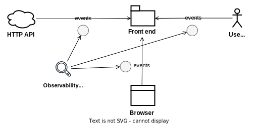
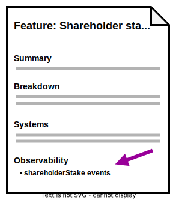

I've been reading the book [_Observability Engineering_](https://info.honeycomb.io/observability-engineering-oreilly-book-2022) by Charity Majors and thinking about how to apply the ideas to front end development.

I find most interesting the concept of a **_structured event_** - an event "which captures everything that occurred while one particular request interacted with your service" <br />(Chapter 5).

Translating this into the world of front end, a structured event might capture everything that happened during a user interaction or receipt of an HTTP response. This might be done by placing event publishing calls at key points in the code, similar to how we might place `console.log` statements for local debugging.

A key benefit of structured events (compared to, say, unstructured logs) is that they are formatted in the shape of a map (a set of key-value pairs), making them queryable. Structured events containing rich contextual information (e.g. current user id, entities being interacted with, etc.) can be sliced and diced in various ways, using the querying facilities of a monitoring platform such as [Sentry](https://sentry.io/).

With structured logging in place developers can "ask" arbitrary questions about how the application is behaving in production, pro-actively search for unanticipated bugs or diagnose difficult errors involving complex front end logic.

In this article I'll describe how I see observability being applied on the front end and cover some examples, based on real life applications I've worked on, using [Sentry](https://sentry.io/) (a popular monitoring platform).

## What does "observability" mean on the front end?

In defining "observability" (Chapter 1), Majors lists the following capabilities:

> - Understand the inner workings of your application
> - Understand any system state your application may have gotten itself into, even new ones you have never seen before and couldn’t have predicted
> - Understand the inner workings and system state solely by observing and interrogating with external tools
> - Understand the internal state without shipping any new custom code to handle it (because that implies you needed prior knowledge to explain it)

Back end services generally respond to requests from a front end or another service.

In contrast, front end applications can respond to:

1. **User events**, such as selecting a drop-down value or clicking a button
2. **HTTP events**, such as receiving a response or receiving a WebSockets message
3. **Browser events**, such as receiving location data or having a `setTimout` elapse or a WebWorker job complete

The above, then, are the points at which we can trigger structured events on the front end, which will allow us to monitor our front end application state in production.

<figure>
  <a href="observability-points.svg">
    
  </a>
  <figcaption>Observability points for typical front end applications: HTTP, user and browser events</figcaption>
</figure>

## Example 1 - User event: Observing a change to a numeric field

<figure style="float: right">
  <a href="observability-points-user-event.svg">
    
  </a>
  <figcaption>Observability point: user interaction.</figcaption>
</figure>

Suppose our front end app validates a change to a numeric field:

When the user edits the stake of a shareholder, we want to validate that the total of all shareholder stakes is never more than 100%. But this only applies to _active_ shareholders – we want to skip shareholders which have been turned off (`enabled: false`).

Here's some sample code (in Typescript with React):

```javascript
// ShareholderStakeEditor.tsx
...
function ShareholderStakeEditor({
  companyId,
  shareholder,
  onClickClose,
}: ShareholderStakeEditorProps) {
  const [stake, setStake] = useState(shareholder.stake);

  const { shareholders, refetchShareholders } = useShareholders();

  const { enableds, others, othersStakesSum, patchShareholderStake } =
    useShareholder({ shareholder, shareholders });

  const othersAndThisStakesSum = othersStakesSum + stake;

  const handleClickSave = async () => {
    if (othersAndThisStakesSum <= 100) {
      await patchShareholderStake(stake);

      await refetchShareholders();
    } else {
      showValidationErrorSelectedNodeStake();
    }
  };
  ...
}
```

We want to make the state of `handleClickSave` observable.

Let's log two structured events:

1. `useShareholderStakeEditor/changeStakeValid` - stake was valid and we will submit a PATCH request
2. `useShareholderStakeEditor/changeStakeSumError` - stakes sum was too high, so we will show an error

<pre data-line="9-24, 28-34, 43-49">
<code class="language-javascript">
function ShareholderStakeEditor({
  companyId,
  shareholder,
  onClickClose,
}: ShareholderStakeEditorProps) {
  ...

  const event = {
    tags: {
      companyId,
      shareholderId: shareholder.id,
      stake,
      enabledsIds: JSON.stringify(map(enableds, "id")),
      othersIds: JSON.stringify(map(others, "id")),
      othersStakesSum,
      othersAndThisStakesSum,
    },
    data: {
      shareholders: JSON.stringify(shareholders),
      enableds: JSON.stringify(enableds),
      others: JSON.stringify(others),
    },
  };

  const handleClickSave = async (e) => {
    if (othersAndThisStakesSum <= 100) {
      captureEvent({
        message: "useShareholderStakeEditor/changeStakeValid",
        tags: event.tags,
        contexts: {
          ["useShareholderStakeEditor/changeStakeValid"]: event.data,
        },
      });

      await patchShareholderStake({
        id: shareholder.id,
        stake,
      });

      refreshShareholders();
    } else {
      captureEvent({
        message: "useShareholderStakeEditor/changeStakeSumError",
        tags: event.tags,
        contexts: {
          ["useShareholderStakeEditor/changeStakeSumError"]: event.data,
        },
      });

      showShareholderStakeError();
    }
  }
  ...
}
</code>
</pre>

<aside class="note">
  <h3 class="note-heading">Aside: Tags vs. contexts</h3>
  <p>In the example, you'll notice that we provide two objects to Sentry: tags and contexts.</p>
  <ul>
    <li><code>tags</code> is a dictionary of strings, which can be used to query across events.</li>
    <li><code>contexts</code> is a more flexible dictionary of any object and can be used to store additional contextual data about an event.</li>
  </ul>
    
  <p>My approach is to put as much queryable data as possible into <code>tags</code> and put everything else into <code>contexts</code>.</p>
</aside>

Suppose we subsequently receive a bug report:

> The user attempted to enter a 20% stake for one node, but got an error, despite the enabled nodes having a total <= 80%.

We might ask ourselves a bunch of questions:

- Why didn't our "enabled" logic work in this case?
- Was there a bug in the front end logic?
- If so, how should we fix it?

Instead of having to guess or consult various sources, wouldn't it be nice if we could more directly observe what happened?

Let's query Sentry for:

- Events generated by this component - `message:"useShareholderStakeEditor*"`
- For this user - `user.id:1234`
- And this company - `companyId:5678`

<figure>
  <a href="example-stake-error-sentry-query.png">
    
  </a>
  <figcaption>Querying Sentry for structured events by message, user id and company id</figcaption>
</figure>

We find our error event - `changeStakeSumError`:

<figure>
  <a href="example-stake-sentry-query-results.png">
    
  </a>
  <figcaption>Sentry query results indicating an error was logged</figcaption>
</figure>

Clicking on the row reveals some interesting details:

<figure>
  <a href="example-stake-sentry-query-result-detail-tags.png">
    
  </a>
  <figcaption>Sentry error details, showing an item with the tags shareholderId: 113 and stake: 30</figcaption>
</figure>

<figure>
  <a href="example-stake-sentry-query-result-detail.png">
    
  </a>
  <figcaption>Sentry error details, showing an item (id: 112) with the word "[Deleted]" in its name</figcaption>
</figure>

We see that the user was trying to set one shareholder (id: 113) to have a stake of 30%.

However, another shareholder (id: 112), which was `enabled: true`, had the word "Deleted" in its name. The presence of the word "Deleted" likely confused the user into thinking that its 40% stake would not included in the total.

Now we have enough information to propose further actions:

1. Solution: We could add logic that removes words like "Deleted" from names of shareholders, to avoid confusing the user like this in future
2. Solution: We could ask the user to disregard words like "Deleted" and share that knowledge with other users publicly (e.g. via Slack)
3. Investigation: We could find out why users were using the word "Deleted" in shareholder names; is the delete function broken?

Notice that we don't have to ask the user questions and wait for their response, nor run the application and attempt to reproduce the error, nor query the database, nor puzzle over server-side logs.

Rather, **_we can to go directly to the root of the problem_**, observing logs generated by the specific part of the code which the user was interacting with at the time of the event.

Even better, by naming each logging statement uniquely and using a strict hierarchical naming convention (e.g. `${component}/${event}`), we can query more broadly by component, then narrow in on the event, to locate the exact line of code which generated the event!

When you think about it, observability is not all that different from the standard practice of adding `console.log` statements at appropriate points and debugging locally – only it's more rigorous and queryable and **_we can observe production_**.

## Example 2 - HTTP event: Observing PATCH and GET responses

<figure style="float: right">
  <a href="observability-points-http-event.svg">
    
  </a>
  <figcaption>Observability point: HTTP event.</figcaption>
</figure>

On saving a shareholder's stake, the front end app should refresh the list of all shareholders' stakes.

But suppose we receive another bug report:

> A user reports that the stakes did not refresh after they saved a stake.

So we ask some questions:

- Why did the refresh not work?
- Was there a problem with the PATCH request?
- Did the front end code handling of the PATCH request fail?
- Was there some other kind of issue?

If we log an event on refresh, it should be easier to find out.

<pre data-line="12-21, 25-34">
<code class="language-javascript">
function ShareholderValueEditor({ companyId, shareholder }) {
  ...
  const handleClickSave = async (e) => {
    if (othersAndThisStakesSum <= 100) {
      ...
      const patchStakeResult = await patchShareholderStake({
        id: shareholder.id,
        stake,
      });

      captureEvent({
        message: "useShareholderStakeEditor/changeStakePatchCompleted",
        tags: event.tags,
        contexts: {
          ["useShareholderStakeEditor/changeStakePatchCompleted"]: {
            ...event.data,
            patchStakeResult,
          },
        },
      });

      const refetchShareholdersResult = await refetchShareholders();

      captureEvent({
        message: "useShareholderStakeEditor/changeStakeRefreshCompleted",
        tags: event.tags,
        contexts: {
          ["useShareholderStakeEditor/changeStakeRefreshCompleted"]: {
            ...event.data,
            refetchShareholdersResult,
          },
        },
      });
    } else {
      ...
    }
  }
  ...
}
</code>
</pre>

As in the previous example, let's query Sentry for:

- Events generated by this component - `message:"useShareholderStakeEditor*"`
- For this user - `user.id:1234`
- And this company - `companyId:5678`

We find our two events - `changeStakePatchCompleted` and `changeStakeRefreshCompleted` - were both logged:

<figure>
  <a href="example-stake-sentry-update-results.png">
    
  </a>
  <figcaption>Sentry query results, indicating that both the patch and refresh completed successfully</figcaption>
</figure>

However, examining the refresh event, we see that the new stake value was not provided.

<figure>
  <a href="example-stake-sentry-update-result-detail-refetch.png">
    
  </a>
  <figcaption>Sentry refresh details, showing stale value for stake of id: 113</figcaption>
</figure>

Now we know why the stake did not refresh properly – the back end is returning stale data! We'll need to discuss cache-busting with the back end developers.

## Example 3 - Browser event: Handling a periodic refetching of data

<figure style="float: right">
  <a href="observability-points-browser-event.svg">
    
  </a>
  <figcaption>Observability point: browser events.</figcaption>
</figure>

For our final example, suppose the front end app should refresh the list of all shareholders' stakes periodically, e.g. every 30 seconds.

We receive the following bug report:

> A user reports after one user had modified the stakes of certain shareholders, the other users didn't see the updates until the following day.

We might ask:

- Why did the auto refresh not work?
- Was there a problem with the GET request or code handling the response?
- Was there a Backend issue, such as a cache becoming stale?

Let's query Sentry for observability on the auto-refresh hook:

- Events generated by the hook - `message:"useShareholdersAutoRefresh*"`
- For this company - `companyId:5678`

We find our autorefresh event - `useShareholdersAutoRefresh` - was logged:

<figure>
  <a href="example-stake-sentry-auto-refresh-results.png">
    
  </a>
  <figcaption>Sentry query results, indicating that the auto refresh completed successfully</figcaption>
</figure>

And hovering over the events column, it looks like it has been running at regular intervals:

<figure>
  <a href="example-stake-sentry-auto-refresh-results-period.png">
    
  </a>
  <figcaption>Sentry query results, indicating that the auto refresh ran many times over the last 24 hours</figcaption>
</figure>

What could have gone wrong? Inspecting the details, we see that different values were returned for one user than for another:

<figure>
  <a href="example-stake-sentry-auto-refresh-details-compare.png">
    
  </a>
  <figcaption>Sentry event details, indicating a discrepancy between data received for two different users</figcaption>
</figure>

This indicates that the back end may be serving stale updates for some users, rather than propagating changes to all users at once.

## Tracing event sequences with breadcrumbs

From the previous examples, you may have noticed continuity between events. For example, the user action of editing a shareholder stake generates a sequence of related events: `changeStakeValid`, `changeStakePatchCompleted`, `changeStakeRefreshCompleted`.

Wouldn't it be nice if we could see a sequence or "flow" of events together in a list?

Thanks to Sentry's [breadcrumbs feature](https://docs.sentry.io/product/issues/issue-details/breadcrumbs/), we can. Simply open the details of one of the events, scroll down to the Breadcrumbs section, then filter by "Tranaction".

<figure>
  <a href="example-breadcrumbs-transactions.png">
    
  </a>
  <figcaption>Sentry event details, breadcrumbs section, listing a sequence of antecedent events</figcaption>
</figure>

## Querying across events

With detailed structured events in place, we can form more interesting queries, proactively searching for anomalies or just simply learning more about how our system functions in production.

For example, as we included `companyId` in the events concerned with shareholders, we could more generally query all events associated with that `companyId`. More powerfully, we could query all events associated with **_any_** `companyId`, that is, all company-related events. This could be useful if company was an important entity in our system and we wanted to prioritise fixing of errors related to that entity.

Or take another example – querying by date and time. We could query for events with `message:"*error*"`, within a time of day in which users are experiencing a lot of issues. This would allow us to diagnose the cause of those issues separately from more time-independent issues.

## Marrying observability to documentation

Documentation can be an excellent place to surface observability.

Links to queries in a monitoring system can be placed in wiki pages, where they can be discovered by our team members or others in the organisation as needed.

For example, from our previous example, wouldn't it be great if a new team member could not only read a textual description of Shareholder stakes, but also be linked to actual production data around this feature?

We could achieve this by querying Sentry for all events with `message:"*shareholderStake*"`, grabbing a link to that query and pasting it into a "Shareholder stakes" wiki page, perhaps under a heading titled "Observability" with a link titled "shareholderStake events".

<figure>
  <a href="docs-observability-section.svg">
    
  </a>
  <figcaption>Example: Shareholder stake feature documentation with Observability section and link to `shareholderStake` event query</figcaption>
</figure>

Imagine if all feature documentation was augmented with links to observability queries. This could give newcomers and experienced team members alike a boost in understanding how each of those features functions in production.

## Managing observability code

In the interests of keeping code clean and readable, we might want to reduce the quantity and complexity of logging code.

Some ideas:

### Abstraction

We can hide logging behind a more abstract function, to reduce its complexity and surface area.

For example, in a React codebase, rather than directly calling `captureEvent` from `@sentry/react`, we could create and consume our own custom hook, named something like `useLogEvent` returning a function like `logEvent`. The hook and function could encapsulate concerns such as caching re-used data and following a hierarchical naming convention.

### Removal

Similar to feature flag controls, logging code could be scheduled for removal after a period of time, if the software has been working well and is considered not in need of monitoring.

Alternately, we could comment-out logging calls or add a special flag to disable them. Developers could quickly determine that the code is not in use and skip over it.

### Aspects

Aspect-oriented programming involves augmenting the behaviour of existing code without modifying it, typically using a declarative pattern such as [decorator](https://www.w3schools.blog/java-decorator-design-pattern). Frameworks such as [AspectJ](https://github.com/eclipse-aspectj/aspectj) are already used for logging in back end systems.

In front end, [Typescript Decorators](https://devblogs.microsoft.com/typescript/announcing-typescript-5-0/#decorators) may in the near future allow logging to be added in a similar, unobtrusive style.

## Security and privacy

A word about security – sensitive data (such as [personal data](https://en.wikipedia.org/wiki/Personal_data)) should probably be omitted from structured events, to avoid data leakage and comply with regulations.

The chance of sensitive data being accidentally leaked grows with increased use of logging in production (as with any other use of data production). So if your system deals with sensitive data, it's crucial to have processes in place to ensure that this data is not leaked in logs. This could be part of a code review process as well as an ongoing independent review process, likely involving examination of both code and logs.

## Conclusion

Observability in software engineering is about observing the internal state of a software system during regular usage in production, typically by capturing and monitoring detailed and structured log outputs.

While more commonly applied to distributed systems on the back end, observability can also be applied to the front end, using front end compatible tools such as Sentry to observe states generated by user, HTTP or browser events.

Distinct from typical logging, structured events capture detailed contextual information surrounding the events and make the events queryable (e.g. with tags in Sentry) and traceable (e.g. with Breadcrumbs in Sentry).

Using structured data generated by production logging, we can diagnose an issue or answer an unanticipated question about the behaviour of the system. Additionally, we can proactively search for issues or anomalies by querying across events. And those queries can be integrated into documentation, where they can be discovered and accessed by engineers or other interested parties.

Observability is a newly emerging field within software engineering, and we can't know for sure what it will look like in the future. Increasing the observability of a front end could potentially be a very worthwhile pursuit, in terms of time and cost saved, where an application is already running in production and complex issues need to be diagnosed and resolved quickly.

## Code example

The source code for the examples mentioned in this article can be found here:

[https://github.com/jonathanconway/observability-example-react](https://github.com/jonathanconway/observability-example-react)

## Further reading

These resources inspired this article:

- [_Observability Engineering_](https://info.honeycomb.io/observability-engineering-oreilly-book-2022) by Charity Majors
- [_Sentry Browser JavaScript Docs_](https://docs.sentry.io/platforms/javascript) by Sentry
