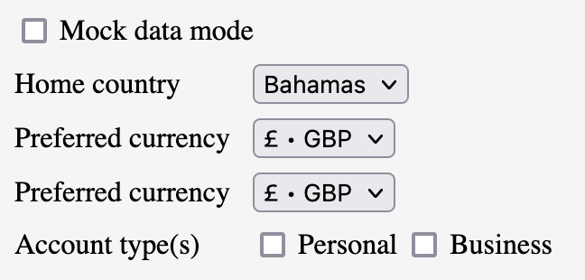

Mock data, dummy data, fake data, test data, sample data.

These terms all express the same thing:

**Data that a developer hard-codes in place of real data.**

In my observation, mock data has tended to be used in a rather loose, slipshod, careless manner. Unlike documentation, it is treated as the garbage of software material. (Sometimes even referred to as "garbage data"). People will try to avoid writing it by using elaborate "generators" such as [jFairy](https://github.com/Devskiller/jfairy) or [zed](https://github.com/brimdata/zed).

My argument in this article is that mock data, when treated with respect, turns out to be a supremely useful, versatile and valuable tool.

I find four special uses for mock data:

1. Iteratively designing and documenting structures
2. Boosting unit test development
3. Manually testing a running application
4. Decoupling development teams

In this article I will elaborate on each of these uses.

## 1. Iteratively designing and documenting structures

Let's begin with an example that should be reasonably familiar to most developers:

**Validating a username in a sign-up form.**

Suppose we want to capture and validate one of three kinds of username:

- an email address -or-
- a 9-character alpha string -or-
- a numeric employee number

We might begin by modelling the `username` field as a `string | number` data-type that covers all three kinds of username.

```typescript
type Username = string | number;
```

The above type expresses a part of our requirements but not all of them. Specifically, it doesn't express such facts as:

- the username might be an email
- the username might be a 9-character string
- the username might be a string longer than 9 characters, but that would be invalid

How might we express these requirements in code prior to writing a validation routine?

One way might be to write descriptive comments next to the field. Another way might be to bring in a hefty and cumbersome "validation framework" such as `zed` and try to twist and wrangle it to the shape of our specific requirements.

Or... we could simply create a few mock values:

```typescript
const UsernameMocks = {
  EMAIL: "user@website.com",
  TEXT_NINE_CHARS: "ninechars",
  TEXT_LONGER_THAN_NINE_CHARS: "longerthanninechars",
  NUMBER: 1234,
};
```

We have now enumerated the variants of the username field that we expect to deal with.

And we've given them descriptive names. Naming them this way helps us to think clearly about the requirement and allows us to document the requirement in code.

Looking at these mock values, we might also begin to ask questions. For example: does a numeric username have a lower and upper bound? Safe assumptions might be `0` and `Number.MAX_SAFE_INTEGER`, but we might want to check with a domain expert.

The point is, by laying out all the expected values of this field together in one view, we give ourselves an opportunity to think more deeply about the range of possible cases and how we will deal with these cases. In this way, mock data becomes a kind of tool for concretising requirements.

We can now begin to think about how we might design and test the validation routine.

## 2. Boosting unit test development

As we begin to write a username validation function, the `Username` type definition combined with `UsernameMocks` given above lead directly to four unit tests:

```typescript
describe("validateUsername", () => {
  it("validates email as true", () => {});

  it("validates text 9 chars long as true", () => {});

  it("validates text more than 9 chars long as false", () => {});

  it("validates number as true", () => {});
});
```

This isn't a coincidence – the whole point of mock data is to represent kinds of values we expect to deal with. Our unit tests need to do the same thing, to verify that the system under test behaves as we expect.

We can now begin to implement the requirement, writing each of the unit tests one by one, and writing enough code to make it pass.

Alternately / additionally, we could use this information about expected inputs to scaffold the function with comments:

```typescript
function validateUsername(username: Username): boolean {
  // If email, return true
  // If number, return true
  // If less than or equal to 9 chars, return true
  // Return false
}
```

This is just scratching the surface!

As we write the tests, we notice that we can reference the mock constants directly inside the test code, to avoid repeating ourselves.

For example:

```typescript
describe("validate username", () => {
  it("returns true for email address", () => {
    const output = validateUsername(UsernameMocks.EMAIL);
    expect(output).toBeTruthy();
  });
});
```

Notice how clean and readable this test is! The naming of the mock constant reveals the intent of the test beautifully. Rather than pollute our test code with concrete values, we can extract them to well-named constants and have the test code focus on the _relationships_ between the values.

The re-use can go even further. Suppose, in a different part of the code, we want to display a user profile which includes the user's username. We want to style the text differently depending on what kind of username the user has.

We might extract the username type and mocks to its own module, say, `username.ts`. Then we can re-use the mock usernames in our tests, like so:

```typescript
describe("user profile", () => {
  it("renders number username in monospace", () => {
    const usernameEl = renderUsername(UsernameMocks.NUMBER);
    expect(usernameEl).toHaveClass("mono");
  });

  it("renders email username in sans-serif", () => {
    const usernameEl = renderUsername(UsernameMocks.EMAIL);
    expect(usernameEl).toHaveClass("sans-serif");
  });

  it("renders alpha username in sans-serif", () => {
    const usernameEl = renderUsername(UsernameMocks.TEXT_NINE_CHARS);
    expect(usernameEl).toHaveClass("sans-serif");
  });
});
```

In future we might need to maintain username code – e.g. support additional kinds of username, remove support for a kind of username, fix a mistake in one of the mock values, etc.

It will be much easier to find the code that needs to change across the whole codebase if we use consistent mock constants than it will be if we use inconsistent mock literals.

<figure class="article-image-container">
  <a
    target="blank"
    href="https://mermaid.live/edit#eyJjb2RlIjoiY2xhc3NEaWFncmFtXG4gICAgY2xhc3MgVXNlcm5hbWUge1xuICAgICAgICA8PHR5cGU-PlxuICAgICAgICB8IHN0cmluZ1xuICAgICAgICB8IG51bWJlclxuICAgIH1cblxuICAgIGNsYXNzIFVzZXJuYW1lTW9ja3Mge1xuICAgICAgICA8PG9iamVjdD4-XG5cbiAgICAgICAgRU1BSUxcbiAgICAgICAgVEVYVF9OSU5FX0NIQVJTXG4gICAgICAgIFRFWFRfTE9OR0VSX1RIQU5fTklORV9DSEFSU1xuICAgICAgICBOVU1CRVJcbiAgICB9XG4gICAgVXNlcm5hbWVNb2NrcyAuLnw-IFVzZXJuYW1lXG5cbiAgICBjbGFzcyBVc2VybmFtZVRlc3RzIHsgPDxUZXN0Pj4gfVxuICAgIFVzZXJuYW1lVGVzdHMgLi4-IFVzZXJuYW1lXG4gICAgVXNlcm5hbWVUZXN0cyAuLj4gVXNlcm5hbWVNb2Nrc1xuXG4gICAgY2xhc3MgVXNlclByb2ZpbGVUZXN0cyB7IDw8VGVzdD4-IH1cbiAgICBVc2VyUHJvZmlsZVRlc3RzIC4uPiBVc2VybmFtZVxuICAgIFVzZXJQcm9maWxlVGVzdHMgLi4-IFVzZXJuYW1lTW9ja3MiLCJtZXJtYWlkIjoie1xuICBcInRoZW1lXCI6IFwiZGVmYXVsdFwiLFxuICBcImhlaWdodFwiOiBcIjMwMHB4XCJcbn0iLCJ1cGRhdGVFZGl0b3IiOmZhbHNlLCJhdXRvU3luYyI6dHJ1ZSwidXBkYXRlRGlhZ3JhbSI6ZmFsc2V9"
  >
    
  </a>

  <figcaption>UML diagram depicting relationships between tests, mocks and types</figcaption>
</figure>

The end result is that any test code that deals with mock values will be:

- faster to write
- easier to read
- more maintainable

**Bonus:** And we're talking about more than just unit-tests here! Mock values can also be used to fill in live component demos (e.g. Storybook stories), dynamic documentation (e.g. Docusaurus pages) and snapshot tests (e.g. PhantomJS screenshots).

## 3. Manually testing a running application

Imagine if our application was augmented with mock data in such a way that all of its features could be used while running purely off the mock data, without ever having to connect to any real data-source. (By 'data-source', I'm referring to things like databases, APIs, etc.)

This capability would offer some unique advantages:

- We could simulate any behavior we desired in our application (by mocking states that could trigger that behavior)
- We could test how the application would respond to an unexpected state (by mocking that state)
- We could run and develop the application entirely on mocks while the external data-source was down, e.g. during an outage or planned maintenance
- We could develop new features in advance of the data-source supporting them (adding mock data as needed and only substituting real data as it becomes available)
- We could demo features of an application to stakeholders prior to having an external data-source to support that feature
- We could mock data to model changes to an external data-source, to clarify our own thinking and/or to communicate requirements to the data-source maintainers

Mocking all of an application's data-sources might seem like a daunting task. However, in my experience, it's easier than it might seem, especially if done in the early stages of a project.

But there are a few pre-requisites.

Firstly, the application needs an interchangeable data-source, so we can switch between real data and mock data. We need to write all our application code against that data-source abstraction, without concern for where the data actually comes from.

<figure class="article-image-container">
  
  <figcaption>Flowchart depicting application switching between real and mock data</figcaption>
</figure>

Secondly, we need to be able to switch the Application state between the real data-source and a mock data-source.

- Some Single Page Application (SPA) projects use a state container such as Redux. In that case, we might dispatch a `SetMockStateAction` which sets an `isMockMode` flag in the store. When this flag is `true`, all data-retrieval actions use mock data rather than making a real HTTP call.

- In other cases (typically a SPA or a micro-service), an HTTP API client sits between the Application state and the HTTP API and calls the HTTP API to fetch data. We could add a `setMockState` method here, which sets a private `isMockMode` field which, when `true`, uses mock data rather than making a real HTTP call. Or we could set up a Dependency Injection (DI) system, in which an abstract `APIClient` interface is implemented by `HttpAPIClient` and `MockAPIClient`, which can be substituted at runtime.

<figure class="article-image-container">
  <a
    target="_blank"
    href="https://mermaid.live/edit/#eyJjb2RlIjoiY2xhc3NEaWFncmFtXG4gICAgY2xhc3MgQXBwbGljYXRpb25TdGF0ZSB7XG4gICAgICAgIDw8Y2xhc3M-PlxuICAgIH1cbiAgICBBcHBsaWNhdGlvblN0YXRlIC4uPiBBUElDbGllbnRcblxuICAgIGNsYXNzIEFQSUNsaWVudCB7XG4gICAgICAgIDw8aW50ZXJmYWNlPj5cbiAgICAgICAgQVBJQ2xpZW50XG4gICAgfVxuXG4gICAgY2xhc3MgSHR0cEFQSUNsaWVudCB7XG4gICAgICAgIDw8Y2xhc3M-PlxuICAgIH1cbiAgICBIdHRwQVBJQ2xpZW50IC4ufD4gQVBJQ2xpZW50XG5cbiAgICBjbGFzcyBNb2NrQVBJQ2xpZW50IHtcbiAgICAgICAgPDxjbGFzcz4-XG4gICAgICAgIE1vY2tBUElDbGllbnRcbiAgICB9XG4gICAgTW9ja0FQSUNsaWVudCAuLnw-IEFQSUNsaWVudFxuIiwibWVybWFpZCI6IntcbiAgXCJ0aGVtZVwiOiBcImRlZmF1bHRcIlxufSIsInVwZGF0ZUVkaXRvciI6ZmFsc2UsImF1dG9TeW5jIjp0cnVlLCJ1cGRhdGVEaWFncmFtIjpmYWxzZX0"
  >
    
  </a>

  <figcaption>UML diagram depicting application state switching between real and mock data</figcaption>
</figure>

The "switch" could be activated by clicking a UI element, e.g. a small checkbox in the footer area of a web page, which is only visible to Admin users. The click handler toggles the Application state between real data-source vs. mocks.

<figure class="article-image-container">
  
  <figcaption>Screenshot of a mock data checkbox</figcaption>
</figure>

Thirdly, we need all of our application state to be mocked in a set of mock constants. This is easiest if the application state is modelled in some more abstract way, e.g. using classes, interfaces, types, etc. That way, we can easily construct our mock data as a realisation of those abstractions.

<figure class="article-image-container">
  <a
    target="_blank"
    href="https://mermaid.live/edit/#eyJjb2RlIjoiY2xhc3NEaWFncmFtXG4gICAgY2xhc3MgQWNjb3VudCB7XG4gICAgICAgIDw8aW50ZXJmYWNlPj5cbiAgICB9XG5cbiAgICBjbGFzcyBNb2NrQWNjb3VudCB7XG4gICAgICAgIDw8b2JqZWN0Pj5cbiAgICB9XG4gICAgTW9ja0FjY291bnQgLi58PiBBY2NvdW50XG4gICAgXG4gICAgY2xhc3MgSW52b2ljZSB7XG4gICAgICAgIDw8aW50ZXJmYWNlPj5cbiAgICB9XG5cbiAgICBjbGFzcyBNb2NrSW52b2ljZSB7XG4gICAgICAgIDw8b2JqZWN0Pj5cbiAgICB9XG4gICAgTW9ja0ludm9pY2UgLi58PiBJbnZvaWNlXG4iLCJtZXJtYWlkIjoie1xuICBcInRoZW1lXCI6IFwiZGVmYXVsdFwiLFxuICBcImhlaWdodFwiOiBcIjMwMHB4XCJcbn0iLCJ1cGRhdGVFZGl0b3IiOmZhbHNlLCJhdXRvU3luYyI6dHJ1ZSwidXBkYXRlRGlhZ3JhbSI6ZmFsc2V9"
  >
    
  </a>

  <figcaption>UML diagram depicting relationships between mock constants and application types</figcaption>
</figure>

It would take significant effort to completely mock the data-sources of a pre-existing application. But that effort could be broken down into smaller pieces and pursued incrementally, similar to adding unit tests.

Once our application is completely augmented with mock data, maintaining the mock data going forward would only add a small overhead (and might even boost development speed, as described in sections 1 and 2).

---

How about switching between _multiple_ mock states? One way would be via a collection of mock controls, presented to Admin users in the UI, allowing the mocks to be adjusted at whatever level of detail is needed. These could be presented in a pop-up modal or panel activated by clicking a Mock Settings button located somewhere out-of-the-way and only accessible to Admin users.

The following screenshot depicts mock controls for a hypothetical online banking application, allowing the user's home country, preferred currency and business / personal accounts to be adjusted.

<figure class="article-image-container">
  
  <figcaption>Screenshot of controls for more complex customization of mock data</figcaption>
</figure>

## 4. Decoupling development teams

Once our entire Application is able to run off mocked data, not only can we _operate_ the application while a data-source is unavailable, but we can also _operate and develop_ application features prior to the data-source even supporting them.

**Mocking our data-sources decouples our team's development efforts from other teams.**

For example, imagine we are working in an _Invoicing_ team in an online banking system. We want to build a "Foreign Accounts" feature. Suppose this feature depends on data from an _Accounts_ team. Without mock data, the Invoicing team might have had to await until the Accounts team had built certain APIs, which it would then consume.

But with mock data, the Invoicing team no longer needs to wait for the Accounts team to support a Foreign Accounts feature, but rather, it can immediately begin developing the Foreign Accounts feature. We merely need to model Foreign Accounts interface in a way that makes sense for Invoicing purposes, and from those models, derive mocks.

<figure class="article-image-container">
  <a
    target="_blank"
    href="https://mermaid.live/edit/#eyJjb2RlIjoiZ2FudHRcbiAgICBzZWN0aW9uIFdpdGhvdXQgTW9jayBEYXRhXG4gICAgICAgIEFjY291bnRzIHRlYW0gcHJvZ3Jlc3MgICAgICAgICAgICAgIDphY3RpdmUsICAyMDE0LTAxLTExIDAwOjAwLCAyaFxuICAgICAgICBJbnRlZ3JhdGlvbiAgICAgICAgICAgICAgICAgICAgICAgICA6YWN0aXZlLCAgMjAxNC0wMS0xMSAwMjowMCwgMWhcbiAgICAgICAgSW52b2ljaW5nIHRlYW0gcHJvZ3Jlc3MgICAgICAgICAgICAgOmFjdGl2ZSwgIDIwMTQtMDEtMTEgMDM6MDAsIDJoXG5cbiAgICBzZWN0aW9uIFdpdGggTW9jayBEYXRhXG4gICAgICAgIEludm9pY2luZyB0ZWFtIHByb2dyZXNzICAgICAgICAgICAgIDphY3RpdmUsICAyMDE0LTAxLTExIDAwOjAwLCAyaFxuICAgICAgICBBY2NvdW50cyB0ZWFtIHByb2dyZXNzICAgICAgICAgICAgICA6YWN0aXZlLCAgMjAxNC0wMS0xMSAwMDowMCwgMmhcbiAgICAgICAgSW50ZWdyYXRpb24gICAgICAgICAgICAgICAgICAgICAgICAgOmFjdGl2ZSwgIDIwMTQtMDEtMTEgMDI6MDAsIDFoXG5cbiIsIm1lcm1haWQiOiJ7XG4gIFwidGhlbWVcIjogXCJkZWZhdWx0XCIsXG4gIFwiZ2FudHRcIjoge1xuICAgIFwiYmFySGVpZ2h0XCI6IDgwLFxuICAgIFwiZm9udFNpemVcIjogMjUsXG4gICAgXCJzZWN0aW9uRm9udFNpemVcIjogMjUsXG4gICAgXCJsZWZ0UGFkZGluZ1wiOiAzMDAsXG4gICAgXCJiYXJHYXBcIjogMjVcbiAgfVxufSIsInVwZGF0ZUVkaXRvciI6ZmFsc2UsImF1dG9TeW5jIjp0cnVlLCJ1cGRhdGVEaWFncmFtIjpmYWxzZX0"
  >
    
  </a>

  <figcaption>GANTT chart depicting hypothetical timelines with vs. without mocks</figcaption>
</figure>

We can develop and test all the Invoicing logic against those mocks. When the Accounts team does finally support Foreign Accounts we can connect our Invoices system to theirs. Any dissonance between their models and ours can be solved by adding a mapping layer, e.g. an `AccountsAPIDataSource` which implements `AccountsDataSource` methods by calling AccountsAPI methods.

<figure class="article-image-container">
  <a
    target="_blank"
    href="https://mermaid.live/edit/#eyJjb2RlIjoiY2xhc3NEaWFncmFtXG4gICAgY2xhc3MgSW52b2ljaW5nQXBwbGljYXRpb24ge1xuICAgIH1cbiAgICBJbnZvaWNpbmdBcHBsaWNhdGlvbiAuLj4gRm9yZWlnbkFjY291bnRzRGF0YVNvdXJjZVxuXG4gICAgY2xhc3MgRm9yZWlnbkFjY291bnRzRGF0YVNvdXJjZSB7XG4gICAgfVxuXG4gICAgY2xhc3MgRm9yZWlnbkFjY291bnRzQVBJRGF0YVNvdXJjZSB7XG4gICAgfVxuXG4gICAgRm9yZWlnbkFjY291bnRzQVBJRGF0YVNvdXJjZSAuLnw-IEZvcmVpZ25BY2NvdW50c0RhdGFTb3VyY2VcbiAgICBGb3JlaWduQWNjb3VudHNBUElEYXRhU291cmNlIC4uPiBBY2NvdW50c0FQSVxuICAgIFxuICAgIGNsYXNzIEFjY291bnRzQVBJIHtcbiAgICB9XG4gICAgIiwibWVybWFpZCI6IntcbiAgXCJ0aGVtZVwiOiBcImRlZmF1bHRcIlxufSIsInVwZGF0ZUVkaXRvciI6ZmFsc2UsImF1dG9TeW5jIjp0cnVlLCJ1cGRhdGVEaWFncmFtIjpmYWxzZX0"
  >
    
  </a>

  <figcaption>UML diagram depicting mapping layout between Accounts application and data-source</figcaption>
</figure>

Notice how we are building our Foreign Accounts feature against a `ForeignAccountsDataSource`, which functions as a kind of contract between the `InvoicingApplication` (which we control) and the `AccountsAPI` (which the other team controls).

This contract helps us to think more clearly about what we need from the Accounts team - the inputs and outputs and behaviors. So we can communicate more clearly with the teams who we depend on about the data we depend on them for.

### Sharing mocked states with team members

With mocked data in place, we can share various configurations of our application with team members such as QA engineers / testers, product owners, usability and accessibility professionals and others.

One technique applicable to web applications (which I used on a recent real-life project) is to configure the mock states via queryString parameters in the URL. The URL can then be shared with anyone who needs to see the web application in the mocked state. Rather than having the team member go through complicated sequences of steps to simulate a given state, all they need to do is to open the link.

For example, if we want to simulate the state in which the user entered a credit card into a payment page, but the card has expired, we might share a URL like this: http://myapp.com/payment-details?mockCreditCardExpired=true. This URL could be used to test the error message that is displayed for expired cards.

### Other uses of mock data

We're talking about more than just simulating expected (or unexpected) application states! We can also simulate large data-sets (e.g. to test scalability), error conditions (to test error handling logic), delays (to test performance under various network conditions) and... well... anything else it's possible and useful to simulate. The ability to simulate specific application states is kind of a super power.

## Summary

We've looked at four interrelated benefits of treating mock data with respect and rigour, with examples / pseudo-code for each.

1. It helps us to clarify our software design by thinking about examples during modelling, before diving in to implementation.
2. It boosts our unit testing efforts by providing a ready-made set of test inputs and making test code more readable and maintainable.
3. It gives us the powerful capability to run our application independent of external data-sources and, as such, to simulate any application behavior we desire.
4. Finally, it decouples us from immediate dependency on other teams while clarifying the relationships between teams by encouraging us to model them as contracts.

These benefits come at a cost. Using mock data in this way requires application code to be structured in a certain way (isolation of Application state). And it takes significant effort to augment a pre-existing application with mock data, especially if that application has complex logic.

Given all of the above, mock data seems best suited to long-term software projects of moderate complexity, where the advantages of using mock data outweigh the costs.

## Related tools

- [Mock Service Worker](https://mswjs.io/), targeted at web/typescript projects, provides some infrastructure for mocking web endpoints. The application can make requests as usual, but MSW can handle the requests and provide mock responses as if the Backend was mocked. The requests will appear in the Network Tab of Developer Tools, just like a regular request.

## Further reading

Books that inspired me:

- _Domain modelling made functional_ • Scott WLASCHIN
- _The art of unit testing_ • Roy OSHEROV
