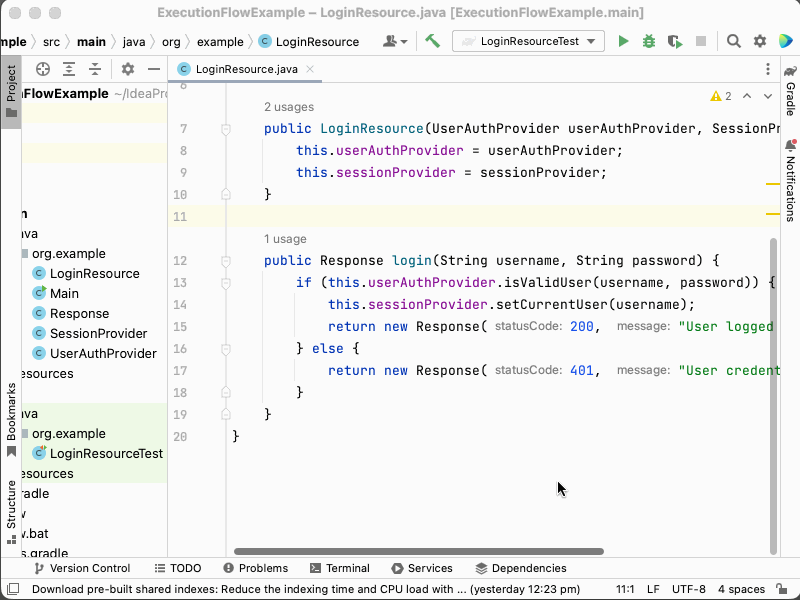

Anyone who has spent some time developing software knows writing new code is but a small part of the job. At least as big, perhaps bigger, is **understanding the existing code**. And that includes understanding the **runtime behaviour** of that code!

I often found myself having to understand a complex execution, entailing many function calls being made and many data types being passed and returned. In order to understand the behaviour of the code, I needed to see the whole flow together at once so I could reason about it. I needed to somehow visualise it, e.g. by listing it out the function calls in a text editor.

In this article I want to share with you my current technique for visualising execution flow, based on the aforementiond experience. I have been developing a format for describing execution flows. Additionally, the format can be instantly converted into a flowchart using a tool called Mermaid.

Execution flow descriptions could be used to help understand an existing code-base, troubleshoot bugs, communicate about the code to other team members and for solution design. 

But first some background...

## What do I mean by "execution flow"?

It's helpful to define the concept of "execution flow".

I'm referring to the path that the runtime will take through the code as it executes the code during a real-life use case.

You should not confuse this with a more specific term: ***call stack***. Since a flow can include multiple function calls in sequence, each producing its own distinct call stack, a flow can include multiple call stacks. Much of the complexity of an execution flow is precisely that calling of multiple functions and the passing of data to them and returning of data from them. So "call stack" is too narrow a term to cover what I'm trying to describe.

On the other hand, you should also not confuse this with a more general term such as ***abstract syntax tree*** or "code structure". We are not describing the code as a whole, but just one path of possible execution of the code. Any piece of code that has one or more conditionals (e.g. `if` or `switch` statement, etc.) will execute differently depending on how those conditionals evaluate. For the same code, different lines might execute depending on the situation (e.g. depending on external state of some kind such as a database, web-service, system clock, etc.). Thus one code base can support multiple execution flows.

## Example of an execution flow

Let's use a hypothetical example – handling a user login on a Java backend.

```java
class LoginResource {
  ...
  private Response login(String username, String password) {
    if (this.userAuthProvider.isValidUser(username, password)) {
      this.sessionProvider.setCurrentUser(username);
      return new Response(200, "Login succeeded.");
    } else {
      return new Response(401, "User credentials are invalid.");
    }
  }
}
```

Can you spot the two execution flows in this code?

### Flow 1 - Logging in successfully

First, we have flow when the user's credentials are valid.

Here's that code example again, with the relevant lines highlighted:

<pre data-line="5-7">
<code class="language-java">
class LoginResource {
  ...
  private Response login(String username, String password) {
    if (this.userAuthProvider.isValidUser(username, password)) {
      this.sessionProvider.setCurrentUser(username);
      return new Response(200, "Login succeeded.");
    } else {
      return new Response(401, "User credentials are invalid.");
    }
  }
}
</code>
</pre>

1. Inside `login()`, the `if` condition calls `UserAuthProvider::checkUserCredentials`, passing user credentials.
2. `UserAuthProvider::checkUserCredentials` returns `true`.
3. Execution proceeds into the `then` block.
4. We call `SessionProvider::setCurrentUser`, passing user credentials.
4. We return `Response`, passing success parameters.

Notice that this isn't just a single call-stack, as there are actually two method calls in this flow, each of which will generate its own call stack.

1. `UserAuthProvider::checkUserCredentials`
2. `SessionProvider::setCurrentUser`

### Flow 2 - Failure to log in

What if the user credentials are *not* valid and `isValidUser` returns `false`?

That would be a separate execution flow.

Here's the code example once more, with the relevant lines highlighted:

<pre data-line="5, 8-9">
<code class="language-java">
class LoginResource {
  ...
  private Response login(String username, String password) {
    if (this.userAuthProvider.isValidUser(username, password)) {
      this.sessionProvider.setCurrentUser(username);
      return new Response(200, "Login succeeded.");
    } else {
      return new Response(401, "User credentials are invalid.");
    }
  }
}
</code>
</pre>

1. Inside `login()`, the `if` condition calls `UserAuthProvider::checkUserCredentials`, passing user credentials.
2. `UserAuthProvider::checkUserCredentials` returns `false`.
3. Execution proceeds into the `else` block.
4. We return `Response`, passing failure parameters.

## IDE tools for determining execution flow

So how to we figure out how our code flows in the first place?

We can, of course, just read the code, open various files as needed, and try to follow along in our head.

Thankfully we also have automated tools to help reduce some of the tedium. You'll likely be familiar with these:

* ***Go to definition*** - we can select a reference (function, class, variable, etc) and be taken to its original definition
* ***Find references*** - we can select a definition (function, class, variable, etc) and pull up a list of all points in the codebase which reference the definition

Different IDEs name these differently, but most mainstream IDEs have them in one form or another, including IntelliJ IDEA, VSCode, Visual Studio and xCode.

<figure>
  
  <figcaption>Screencast of a developer using Go to definition tool in IDEA</figcaption>
</figure>

For example, in the code sample given previously, we might use *Go to definition* to locate the class whose `login` method is being called.

1. Go to the `LoginResource` class and its `login` method.
2. Right-click the `isValidUser` call and select "Go to definition".
3. Observe that it is defined in the `UserAuthProvider` class and its `isValidUser` method.
4. Go back the `LoginResource` class and its `login` method.
5. Right-click the `setCurrentUser` call and select "Go to definition".
6. Observe that it is defined in the `SessionProvider` class and its `setCurrentUser` method.
7. Go back the `LoginResource` class and its `login` method.
8. Observe that a new `Response` object is constructed.

We might want to find out where else the `UserAuthProvider::isValidUser` method is called.

Supposing there was a `RegisterResource` class having a `register` method, as shown below:

<pre data-line="5-7">
<code class="language-java">
class RegisterResource {
  ...
  private Response register(String username, String password) {
    if (this.userAuthProvider.isValidUser(username, password)) {
      this.sessionProvider.setCurrentUser(username);
      return new Response(200, "Login succeeded.");
    } else {
      this.userAuthProvider.registerUser(username, password);
    }
  }
}
</code>
</pre>

Then we might locate this piece of code by using the  *Find references* tool:

1. Go to the `UserAuthProvider` class and its `isValidUser` method.
2. Right-click the `login` method and select "Find usages".
3. Observe that it is called in the `LoginResource` class, in its `login` method.
4. Observe that it is also called in the `LoginResource` class, in its `register` method.
5. Observe that a new `Response` object is constructed.

## Describing execution flows with text

Suppose we wanted to make some notes of the execution flows we discovered. Maybe there are too many for us to easily memorise. Perhaps we want to see them all in one view rather than scattered among many files.

Let's start with the first flow – successful login:

```mermaid
LoginResource::login

  --->|userName,password| UserAuthProvider::isValidUser
  ---|true| LoginResource::login

  --->|userName,password| SessionProvider::setCurrentUser
  --- LoginResource::login

  --->|200,'Login succeeded.'| Response::constructor
```

Then the second flow – successful login:

```mermaid
LoginResource::login

  --->|userName,password| UserAuthProvider::isValidUser
  ---|false| LoginResource::login

  --->|401,'Login failed. Invalid credentials.'| Response::constructor
```

And the final flow – register:

```mermaid
LoginResource::register
  --->|userName,password| UserAuthProvider::isValidUser
  ---|true| LoginResource::register

  --->|200,'Login succeeded.'| Response::constructor
```

Now we can step back and look at all these flows together and see the bigger picture, e.g. how login and register both check user validity using `UserAuthProvider`, and how both instantiate the Response class with various constructor parameters.

<div class="note">
  <h3 class="note-heading">Sketching execution flows</h3>
  <p>Observe that we don't have to cover the flows exhaustively, nor do we have to limit our coverage. We can cover just the parts of code that we are concerned with, based on our current goal, e.g. to solve the current bug or to learn more about a specific part of the code-base. We can make a kind of "partial sketch" of the parts of the execution flows that interest us.</p>

  <p>For example, we don't cover how <code>login</code> and <code>register</code> are called, and we don't cover which further calls are made by <code>UserAuthProvider</code>, <code>SessionProvider</code> or <code>Response</code>, if those parts of the code don't interest us.</p>

  <p>And if we are dealing with a bug in which <code>isValidUser</code> incorrectly returns <code>false</code>, we can focus more on <code>isValidUser</code> and which methods it calls.</p>
</div>

## Format for notating execution flows

Did you notice the textual format used in the previous section to notate the execution flows?

Let's deep-dive into that.

```mermaid
Class::methodCalling
  --->|parameters| Class::methodBeingCalled
  ---|return values| Class::methodCalling
```

* `Class::methodCalling` - the caller
* `--->|parameters|` - execution flowing from caller to callee, with the parameters being passed in the call
* `Class::methodBeingCalled` - the callee
* `---|return values|` - execution flowing from callee back to caller, the value returned from the callee
* `Class::methodCalling` - the caller (again)

We can chain these together to notate a sequence of consecutive calls.

For example:

```mermaid
Class1::method
  --->|parameters| Class2::method
  --->|parameters| Class3::method
  ---|return values| Class2::method
  ---|return values| Class1::method
```

## Repeated calls, closures, indirect calls and line numbers

Thusfar we've use the `Class::method` format to reference the callers and callees. This works reasonably well for classical OO code-bases written in Java, C#, ECMASript, etc.

But what if we want to reference code in other ways, such as named closures, for languages written in Javasript, Typescript, etc.?

Here are some notations that could allow such structures to be referenced:

### Nested closure

<code>foo_bar</code> - Reference a closure witin another closure.

For example: <code>retry_handleTimeout</code> references a <code>handleTimeout</code> function nested inside a <code>retry</code> function in Javasript.</td>

### Multiple repeated calls

<code>#n</code> - Reference multiple calls to the same function or method, where `n` is the current call count.

For example: <code>retry_handleTimeout#2</code> references the 2nd call to <code>retry_handleTimeout</code> in the flow.

### Row/column

<code>:r,c</code> - Reference a line number (and, optionally, column number) within a file.

For example: <code>retry_handleTimeout:4</code> references the call to <code>retry_handleTimeout</code> which occurs on line 4 of the file in which it occurs.

### Indirect call

<code>-.-></code> - References an indirect method call - a call which our code doesn't make directly, but causes to be made, such as calling `setTimeout` on a function in Javascript. It looks like a dotted line.

### Example in Javascript

Let's use an example – a recursive Javasript function – to put all these ideas together.

```javascript
1 function retry(action, times, count = 1) {
2   const timeout = (Math.pow(count, 2)) * 1000;
3   
4   setTimeout(function handleTimeout() {
5     if (!action() && count <= times) {
6       retry(action, times, count + 1);
7     }
8   }, timeout);
9 }
```

`retry` is a recursive function, which calls `setTimeout`, passing a closure. That closure executes. Depending on the number of times `retry` has called itself already (`time`), it may call `retry` again or simply do nothing, halting the recursion.

We can notate this execution flow, including the closure, using the nested closure, multiple calls, row/column and indirect call notations given above, in the following manner:

```mermaid
retry
  -.->|action, times=3| retry_handleTimeout#1:4
  ---> action#1:5
  ---|false| retry_handleTimeout#1:4
  --->|action, times=3, 2| retry:6
  -.->|action, times=3, count=2| retry_handleTimeout#2:4
  ---> action#2:5
  ---|true| retry_handleTimeout#2
```

## Visualising flows with Mermaid

Now the juicy part – lets look at how this format can be instantly converted into a visual flowchat using Mermaid!

[Mermaid](https://mermaid.js.org/) is a free, open-source tool, which takes code written in a specific syntax and converts it into a diagram.

You can run Mermaid in the browser using [Mermaid Live](https://mermaid.live/), or if you prefer, you can download and run it locally using the instructions on the [mermaid-live-editor](https://github.com/mermaid-js/mermaid-live-editor) GitHub profile.

<div class="note">
  <p>Note: You'll need to add the keyword <code>graph</code> to the top of the text.</p>
</div>

The following is how our two earlier Java examples – login success and login failure – render in Mermaid:

<figure>
  <a href="https://mermaid.live/edit#pako:eNqVkEFLBDEMhf9KyWUvM7J47EEQ9SaLuOipl9JkdwrTdkhaRbb7383Iop4ET01fXr-k7wShIIGFI_tlcvmxHGN-JimNA1k7r1eXjRnH8aY3Id75RMPiRd4LYzcvKt22Oj1xeYtIbG2UVz9HXBuXh71yo27-i96TSCz5hyxU7xoz5foL_jf2ersdNl8OIy0EIiS82nSj_qVkUX_QQ_cLtSgRBkjEyUfURE4rxUGdKJEDqyXSwbe5OnD5rFbfatl_5AB2_eAAbUFf6T56zTKBPfhZvtUHjDrhIp4_AZ9shW8">
    
  </a>
  <figcaption>Login success flow example rendered by Mermaid</figcaption>
</figure>

<figure>
  <a href="https://mermaid.live/edit#pako:eNp9kDtrAzEMx7-K0ZLlLjTQyUOh0A6FUkJLM3kRli5n8OPwI6XE-e7RhXTtJOkv6afHGWwiBg3HjMts4ns6uvjJJbVsWWu_hiYqNY7jU2-F8wcGHhYs5Sdl6upbpOdW531OJ0ectXblgN7Rmrg39gl94a7-ZT8-7IbNrUJN6DzTVr3F00pSNjNxrE4o201XQlhSLEKwYmputiYZBQMEzgEdyTXnlWugzhzYgBaXeMLmqwETL1KKraav32hBC4AHaAth5ReH8ocA-rbxn_pKTibcxcsVXrFsig">
    
  </a>
  <figcaption>Login failure flow example rendered by Mermaid</figcaption>
</figure>

And here's the Javascript example:

<figure>
  <a href="https://mermaid.live/edit#pako:eNqFkMEKwjAMhl-lxGsnOG-D7aRPoMeChDVzhbWVLj0M57tbp_MwHN7Cl_9P_uQOtdcEBVwD3lrlAnEYlBMi22bViDUb76RgY6kv96OY2pcWne7onKCPvNlN8iyrxFv-BWODXU9_TMsdUuQfx1oKKWofHZf578n5Ms4MRg5xJU0OEiwFi0anV9xfBgXckiUFRSo1NRg7VqDcI0kxsj8NrobiNVJCvGlkOhhMT7RQTGfP9KgN-_CBjye89H2M">
    
  </a>
  <figcaption>Javascript recursive function example rendered by Mermaid</figcaption>
</figure>

Notice how Mermaid arranges the diagram so that calls consistently flow from top-to-bottom and left-to-right, in the order in which they're written in the diagram code. This makes the flows easy to visually scan become familiar with.

Imagine this appearing in a Slack conversation:

<figure>
  
  <figcaption>Screenshot of an execution flow diagram posted in Slack</figcaption>
</figure>

It could potentially be easier to read and follow an execution flow diagram than to read paragraphs of text trying to describe in plain language the complex sequence of calls.

<div class="note">
  <h3 class="note-heading">Asynchronicity and concurrency</h3>
  <p>Though we touched on async in the Javascript example with the <code>setTimeout</code> call, we haven't fully addressed the issue of describing asynchronicity or concurrency in execution flows.</p>

  <p>This is probably a fairly deep topic that deserves a dedicated article. However I have no doubt it can be represented diagramatically, as long as a strict convention is adhered to.</p>
</div>

## Isn't this just a flowchart?

Yes, but it's a ***specialised*** form of flowchart, focussed on representing execution flow.

The flowchart directly maps to the code it represents, so it accurately and unambiguously conveys information about that code. At the same time, because it's not actually code, but a diagram, it allows us to more easily view and reason about the code in terms of execution flows specifically. We don't have to jump around between files, scroll up and down, etc. but can see a whole execution flow in one screen.

Also by establishing and adhering to a convention in how we represent callers, callees, parameters and return values, etc. this flowchart technique is re-usable across programming languages, codebases, business domains, etc. A similar versatility is found in UML, sequence diagrams and other kinds of specialised diagram formats.

## Why not use sequence diagrams?

You might have seen diagrams similar to those described here, but laid out as sequence diagrams. Execution flows can certainly be visualised as sequence diagrams. A sequence diagram is arranged as a set of vertical columns connected by arrows, where each column represents a method and each arrow represents a call.

<figure>
  <a href="https://mermaid.live/edit#pako:eNqdkUFLAzEQhf_KMud1KR5zKIh68yAtesplSKZtYDdZZzKKlP53J9YWBNmDOYTJ4-XL4-UIoUQCBz4LvSnlQA8J94yTz52tp7JPeUNSlAMNYzvdrNcvQnyn9fDM5T1F4iHJK44pNt11anvGifoZRT4KxzNq6ZIx_3jJdZWVfF6KsiWRVPIVKlTvlZly_R3mzFh2_z-FCXOxBofL4Lrb1ar38G3vREMgihQHb0VDDxPxhCla78eG9VAPZBnB2RhphzrW5jyZFbWW7WcO4FqMHnSOWC-fBG6Ho1zVx5hq4R_x9AXa0Ku1">
      
  </a>
  <figcaption>Login success flow example as a sequence diagram rendered by Mermaid </figcaption>
</figure>


There are weaknesses of sequence diagrams, however.
* They present each method in a column, so we may soon run out of horizontal space, whereas flowcharts can flow ***down and across***. Also, even for lengthy flowcharts, scrolling up and down is easier on most devices than scrolling side-ways.
* They may position the caller and the callee very far apart, so that the eye has to scan back and forth over a large distance to see the call, whereas flowcharts can more position the caller and callee closer together, making scanning easier.

For these reasons, I find the flowchart format more appealing. 

## Are there tools that generate execution flowcharts automatically?

Surprisingly, not really.

For dependency visualisation, I found a [few](https://marketplace.visualstudio.com/items?itemName=sz-p.dependencygraph) [interesting](https://marketplace.visualstudio.com/items?itemName=lilinhao.vscode-pylonn) [plugins](https://marketplace.visualstudio.com/items?itemName=CodeLogic.vscodecape) for VSCode, and also experimented with [IDEA's dependencies analysis](https://www.jetbrains.com/help/idea/dependencies-analysis.html) tool.

However, all of these tools are focused on reporting ***compile-time dependencies***, which are a different kind of thing to ***execution flows***.

Dependency graphs of course help us to understand how code is structured, but they don't give us the full picture of which parts of that code execute in which order at runtime. For that, we really need execution flows.

Theoretically any tool that could automatically report execution flows would need to be able to analyse the code in terms of its expected execution at runtime. The tool might, like a debugger, execute the code, in order to determine the flow of control, e.g. where the flow of control depends on some state which can only be discovered at runtime. Or it could statically analyse the code to determine all possible flows and generate a report of all of them.

It's beyond the scope of this article to look into how such a tool could be developed, but it's something I'm interested in looking into and perhaps even undertaking myself.

## Conclusion

This article has outlined a format for describing execution flow, which can be used to visualise and understand how parts of a codebase execute at runtime (and generate diagrams).

This understanding can help to diagnose bugs/errors, determine the best points at which to change the code, estimate how long changes might take, and no doubt many other use cases.

I hope you find it useful!


## Further reading

These books inspired this article:

- _The pocket guide to debugging_ • Julia EVANS
- _UML distilled_ • Martin FOWLER


