> Summary: Core concepts in the AI landscape include:
> - **Prompts** and **Commands** issued by humans to Assistants
> - **Assistants** that use LLM technology to provide useful output
> - **Models** (LLM) that Assistants query
> - **Skills** and **Tools** that augment Assistants with useful capabilities
> - **Commands** issued by humans to Assistants for immediate action
> - **Agents** and **Sub Agents** that complete tasks autonomously
> - **Plan mode** issued by humans to Assistants for immediate action

I've seen certain questions of definition coming up lately among colleagues and the tech community, in relation to AI assistant and tooling.

What is an Agent? What is the difference between Skills and Agents? How should I decide which to use when?

In this article, I will try to clarify these concepts. I'll provide a clear definition of each of them, when they're used and how they relate to eachother. 

I'll aim to do all this in an Assistant-agnostic way, so you can use them with Claude Code, OpenAI Codex or any other Assistant or framework.

## Context

I don't pretend to be an expert on this topic. But writing about it is fun. We can all learn better by teaching others and I encourage you to also write on AI. I can also offer a less biased view and possibly a more relatable perspective, being just a typical software engineer.

AI, as an idea, has been around [since at least the 1950s](https://en.wikipedia.org/wiki/Lisp_(programming_language)), and, depending on your definition, perhaps even since ancient times. Recently it has been undergoing a period of dramatic evolution and popularisation, thanks in part to cheap high-scale microchip production, [advances in model design](https://en.wikipedia.org/wiki/AI_boom) and economic imperatives.

By my own estimation, we are entering the Deployment phase of Perez' Technological Surge Cycle, with respect to AI. At this time, the conceptual framework is beginning to solidify and key companies and products are becoming established.

## Definitions

### Assistant

An assistant is a piece of software that takes human input and uses LLM technology to provide a useful output, such as a reply, code changes, etc.

Assistants are typically implemented as mass market software applications by major AI firms such as OpenAI, Claude, Google and Microsoft.

Predominant assistants, at the time of writing, are:

-  [Claude Code](https://claude.com/product/claude-code)
-  [GitHub Copilot](http://copilot.microsoft.com)
-  [OpenAI Codex](http://openai.com)
-  [Google Antigravity](https://antigravity.google)
-  [Cursor](https://cursor.com)

Up-and-coming smaller players include:

```mermaid--svg
%% @description Assistant and its relationship to human and model

flowchart

Human -->|chats with| Assistant
Assistant -->|queries| Model
Assistant -->|performs| Action

Action --- Response
Action --- Task
Action --- Coding
Action --- etc

Human["🤷 Human"]
Assistant["🤖 Assistant"]
Model["📀 Model"]
```

-  [V0 by Vercel](https://v0.app)

### Model

A model is, at core, a very big [vector database](https://en.wikipedia.org/wiki/Vector_database). This is a kind of database in which searches can be done semantically, by similarity. This structure and search interface, at a large scale, is what enables models to take human language as input and provide useful output.

Predominant large language models / model series (LLMs), at the time of writing, include:

- [GPT series](https://en.wikipedia.org/wiki/Generative_pre-trained_transformer) from OpenAI
- [Claude Opus series](https://en.wikipedia.org/wiki/Claude_(language_model)) from Anthropic
- [Gemeni](https://en.wikipedia.org/wiki/Gemini_(language_model)) from Google

Some Assistants allow you to select a model to use. For example, Claude Code allows you to select between different models in the Opus series, such as Opus 1, Opus 2 and Opus Pro. This allows you to select the most appropriate model for your use case, based on factors such as performance, cost, etc.

> Note: RAG (Retrieval Augmented Search) is a software pattern by which Assistants can look up additional information to supplement that found in models. This can allow Assistants to incorporate more up-to-date or detailed information, from weather forecasts to stock prices.

```mermaid--svg
%% @description Model with examples

flowchart

Model["📀 Model"]

GPT -->|is a| Model
Opus -->|is a| Model
Gemeni -->|is a| Model

Assistant["🤖 Assistant"]
Model -->|is used by| Assistant

RAG["Retrieval Augmented Search (RAG)"]
Model -->|is combined with| RAG
```

### Prompt

Prompts are texts written in human-language and submitted to Assistants for processing.

Good prompts are specific and carefully structured so as to generate useful results from Assistants.  Prompt engineering is the art and science of writing effective prompts.

Prompts are typically written by humans (or re-used from shared prompt libraries) and submitted via a web interface, command line interface or IDE extension.

Prompt interfaces:

- Claude
  - Web interface: https://claude.ai
  - Command-line interface: `claude`
- Copilot
  - Web interface: https://copilot.microsoft.com
  - IDE extension: https://code.visualstudio.com/docs/copilot/overview (VS Code)

Prompt libraries:
- 

Prompts can also be generated on-the-fly by software, including Agents. For example, a customer support agent could receive support requests from customers and convert them into prompts which generate a suitable conversational reply from an Assistant.

### Agent

An agent is a piece of software that take input (human and/or otherwise), runs autonomously and uses LLM technology to make decisions and take actions, likely to produce a useful outcome, such as customer support requests being actioned, code being written and deployed, etc.

Agents can run autonomously – that is, without direct human initiation. For example:
- In a continuous or periodic manner, such as hourly or daily
- In response to an event, such as a customer request or online order

Agents are typically implemented as customised software programs, written by software engineers in languages such as Python, Typescript, etc. They are structured as a loop, referred to as an "agent loop", where the application cycles continuously between taking input, making decisions and taking actions.

Agents can call APIs provided by Assistants, such as Claude Agent SDK, to utilise LLM capabilities and perform certain actions.

```mermaid--svg
%% @description Agent with Trigger, Agent Loop and Assistant API

flowchart
Trigger["⚡️ Event, Period, etc."]
Trigger-->Agent

subgraph "🖥️ Agent"
  Agent
  Agent-->AgentLoop
  AgentLoop["🖥️ Agent Loop"]
  AgentLoop-->AgentLoop
end

Agent-->AssistantAPI
AssistantAPI["📚 Assistant API"]
```

### Sub Agent

A Sub Agent is an agent that is called by another agent, to perform a more specific task. Sub Agent are used to break down complex tasks into smaller, more manageable pieces, and to allow for better modularity and separation of concerns.

Sub Agents are typically implemented as customized software programs (possibly containerized), code libraries and/or configuration for Assistants, such as an agents folder.

Sub Agents, being modular, can:
- Be re-used across multiple agents
- Be scaled independently for high demand, cost reduction, performance, etc.
- Be combined with other Sub Agents to collaborate in multi-agent workflows

For example, Sub Agent could be run in parallel as serverless functions, which could be scaled horizontally to a handle large number of requests, scaled elastically to minimise costs, etc.

Examples:

- https://github.com/VoltAgent/awesome-claude-code-subagents

```mermaid--svg
%% @description Agent and Sub Agents pattern

flowchart

Agent["🖥️ Agent"]
Agent-->SubAgent1["🖥️ Sub Agent 1"]
Agent-->SubAgent2["🖥️ Sub Agent 2"]
Agent-->SubAgent3["🖥️ Sub Agent 3"]
```

 
 

```mermaid--svg
%% @description Sub Agent Multi-Agent pattern

flowchart LR

SubAgent1-->SubAgent2["🖥️ Sub Agent 1"]
SubAgent1-->SubAgent3["🖥️ Sub Agent 2"]
SubAgent2-->SubAgent3["🖥️ Sub Agent 3"]
SubAgent3-->SubAgent4["🖥️ Sub Agent 4"]
```

### Skill

A skill is a specific capability or function that an Agent or Assistant can perform. Skills are typically implemented packages combining an Agent-friendly description, instructions on when to use them and any resources needed to apply the skill, such as code files, images, etc.

For example, a skill for "designing a front end interface" might include:

- Description: "Create distinctive, production-grade, brand-aware frontend interfaces with high design quality."
- When to use: "Use this skill when the user asks to build web components or views in the frontend application."
- General guidance: "Use this skill to design the frontend interface, including layout, color scheme, typography, and overall visual aesthetics. Ensure that the design is distinctive, production-grade, and brand-aware."
- Packaged resources: 
  - PDF file containing branding guidelines, color palette, typography rules, etc.

An Agent or Assistant will read the Skill description and "When to use" instructions to determine when to apply the skill. When the skill applies, they will then access the files inside the skill package in order to apply the skill and perform the task.

I have heard skills referred to as the "arms and legs" of an agent. Similarly to how humans arms and legs allow us to perform a wide variety of tasks, skills allow agents to perform a wide variety of tasks by augmenting them them with specific capabilities and functions. Just as arms and legs can be used for different purposes (e.g., walking, running, grasping objects), skills can be used for different purposes (e.g., summarizing text, generating code, answering questions).

Skills, being modular, can:
- Be re-used across multiple agents and assistants
- Be shared across teams and the community, for example via private or public repositories of skills

Examples:

- https://github.com/anthropics/skills
- https://github.com/forrestchang/andrej-karpathy-skills

```mermaid--svg
%% @description Skill utilised by Agent to perform Task

flowchart

Agent["🤖 Assistant"]

Agent-->Task1
Agent-->Task2
Agent-->Task3
Agent-->Task4
Agent-->Task5

subgraph "Tasks"
Task1["Task"]
Task2["⭐️ Task"]
Task3["Task"]
Task4["⭐️ Task"]
Task5["Task"]
end

Task2-->Skill1
Task4-->Skill2

subgraph "Skills"
Skill1["📂 Skill"]
Skill2["📂 Skill"]
end
```
 

 
 

```mermaid--svg
flowchart

subgraph "Skill"

subgraph "Package"
PDF["PDF"]
Images["Images"]
Videos["Videos"]
etc["etc"]
end

subgraph " "
Description["📝 Description"]
How["📝 How to Use"]
end

end
```

### Tool

Similar to a skill, a tool augments an assistant.

The difference between a skill and a tool, from what I can tell, is that a tool is integrated more directly into an assistant via purpose-built software.

For example, [MCPs (Model Context Protocol)](https://en.wikipedia.org/wiki/Model_Context_Protocol) are a category of AI tool, built by developers, allow Assistants to connect to external data sources or perform actions via a web (HTTP) interface.

Comparison of skill vs tool:

<table>
<thead>
<tr>
<th width="50%">Skill</th>
<th width="50%">Tool</th>
</tr>
</thead>
<tbody>
<tr>
<td>Augments an Agent with additional capabilities</td>
<td>Augments an Agent with additional capabilities</td>
</tr>
<tr>
<td>Is implemented or applied by an end-user or application developer</td>
<td>Is implemented by software engineers at a product vendor, such as a cloud service, hosting provider, etc</td>
</tr>
<tr>
<td>May be written in a more human format, such as a SKILL.md file</td>
<td>Is typically written in a programming language (such as Typescript, Python, Java, etc) with a software interface (such as HTTP for MCPs)</td>
</tr>
</tbody>
</table>

### Command

A command is a specific instruction for an Assistant to run immediately, typically provided by a human in real time.

Commands could be considered an AI equivalent of system commands, scripts, macros, etc.

They are typically signalled with a `/` (slash) prefix. For example: `/review` to perform a code review.

Examples:

- `/checks` - run checks such as linters, unit tests, etc.
- `/setup` - setup the development environment
- `/review` - perform code review

## Relationships

The following diagram roughly maps out how the concepts relate to eachother.

```mermaid--svg
%% @description Relationships between concepts

flowchart
    Human["🤷 Human"] -->|sets up| Agent["🖥️ Agent"]
    Assistant["🤖 Assistant"] -->|queries| Model["📀 Model"]
    AssistantAPI["🤖 Assistant API"] -->|queries| Model["📀 Model"]
    Agent["🖥️ Agent"] -->|calls| SubAgent["🖥️ Sub Agent"]
    SubAgent["🖥️ Sub Agent"] -->|calls| SubAgent["🖥️ Sub Agent"]
    Assistant["🤖 Assistant"] -->|uses| Skill["📂 Skill"]
    Human["🤷 Human"] -->|issues| Command["⚡️ Command"]
    Human["🤷 Human"] -->|writes| Prompt["⌨️ Prompt"]
    Prompt["⌨️ Prompt"] -->|is evaluated by| Assistant["🤖 Assistant"]
    Command["⚡️ Command"] -->|is executed by| Assistant["🤖 Assistant"]
    Agent["🖥️ Agent"] -->|calls| AssistantAPI["☁ Assistant API"]
    SubAgent["🖥️ Sub Agent"] -->|calls| AssistantAPI["☁ Assistant API"]
```

🤖 Assistant-based:
- Humans issues Prompts and Commands to Assistants
- Assistants query Models and use the results to return useful outputs back to Humans
- Assistants are augmented by Skills, helping them complete tasks they would otherwise struggle with

🖥️ Agent-based:
- Humans set up Agents in order to complete tasks autonomously
- Agents delegate work to Sub Agents
- Agents call Assistant APIs for AI capabilities
- Assistants query Models and use the results to return useful outputs back to Agents

## When to use

<table>
  <thead>
    <tr>
      <th>Concept</th>
      <th>Where to use</th>
    </tr>
  </thead>
  <tbody>
      <tr>
        <td>Assistant</td>
        <td>
          <ul>
            <li>Writing application and test code</li>
            <li>Writing AI context files such as skills, commands and documentation</li>
          </ul>
        </td>
      </tr>
      <tr>
        <td>Model</td>
        <td>
          <ul>
            <li>Selecting an appropriate model for an Assistant to use</li>
          </ul>
        </td>
      </tr>
      <tr>
        <td>Agent</td>
        <td>
          <ul>
            <li>Developing an AI solution that requires autonomous decision-making and action</li>
          </ul>
        </td>
      </tr>
      <tr>
        <td>Sub Agents</td>
        <td>
          <ul>
            <li>Developing AI solutions that require multiple agents working together</li>
          </ul>
        </td>
      </tr>
      <tr>
        <td>Skills</td>
        <td>
          <ul>
            <li>Helping an Assistant become more capable, if it struggles to perform certain tasks correctly</li>
            <li>Developing reusable capabilities that can be composed into larger AI solutions</li>
            <li>Sharing capabilities across teams and/or the broader community</li>
          </ul>
        </td>
      </tr>
      <tr>
        <td>Commands</td>
        <td>
          <ul>
            <li>Providing specific instructions for an Assistant to execute immediately</li>
            <li>Triggering specific actions or workflows within an AI system</li>
          </ul>
        </td>
      </tr>
  </tbody>
</table>

## Further reading

- [Claude Code docs](https://code.claude.com/docs)
- [Claude Code tutorial (NetNinja)](https://www.youtube.com/playlist?list=PL4cUxeGkcC9g4YJeBqChhFJwKQ9TRiivY)
- [OpenAI Codex tutorial (NetNinja)](https://www.youtube.com/watch?v=tIb_TzVNbDM)
- [A Guide to Which AI to Use in the Agentic Era (Ethan MOLLICK)](https://www.oneusefulthing.org/p/a-guide-to-which-ai-to-use-in-the)
- [Algorithms (Panos LOURIDAS)](https://direct.mit.edu/books/book/4869/Algorithms)
