> Summary: Core concepts in the AI landscape include:
> - **Prompts** and **Commands** issued by humans to Assistants
> - **Assistants** that use LLM technology to provide useful output
> - **Models** (LLM) that Assistants query
> - **Skills** and **Tools** that augment Assistants with useful capabilities
> - **Commands** issued by humans to Assistants for immediate action
> - **Agents** and **Sub Agents** that complete tasks autonomously
> - **Plan mode** issued by humans to Assistants for immediate action

> Pull-quote: So I now seem to be able to lay it down as a general rule that whatever I perceive very clearly and distinctly is true.
>
> – DESCARTES • _Third Meditation_

I've seen questions of definition come up lately around AI.

What is an agent? What is the difference between skills and agents? How should I decide which to use when?

In this article, I will try to clarify these into "clear and distinct" concepts. To provide a clear definition of each, when they're used and how they relate to eachother.

I'll aim to do all this in an assistant-agnostic way, so you can use them with Claude Code, OpenAI Codex or any other assistant or framework.

## Definitions

### Assistant

An assistant is a piece of software that takes human input and uses LLM technology to provide a useful output, such as a reply, code changes, etc.

Assistants are typically implemented as mass market software applications by major AI firms such as OpenAI, Claude, Google and Microsoft.

Predominant assistants, at the time of writing, are:

-  [Claude Code](https://claude.com/product/claude-code)
-  [GitHub Copilot](http://copilot.microsoft.com)
-  [OpenAI Codex](http://openai.com)
-  [Google Antigravity](https://antigravity.google)
-  [Cursor](https://cursor.com)

Up-and-coming smaller players include:

-  [V0 by Vercel](https://v0.app)
-  [Devin](https://devin.ai)

```mermaid--svg
%% @description Assistant and its relationship to human and model

flowchart

Human -->|chats with| Assistant
Assistant -->|queries| Model
Assistant -->|performs| Action

Action --- Response
Action --- Task
Action --- Coding
Action --- etc

Human["🤷 Human"]
Assistant["🤖 Assistant"]
Model["📀 Model"]
```


### Model

A model is, at core, a very big [vector database](https://en.wikipedia.org/wiki/Vector_database). This is a kind of database in which searches can be done semantically, by similarity. This structure and search interface, at a large scale, is what enables models to take human language as input and provide useful output.

Vector search algorithms and databases have been around since the early days of Google, but it's only more recently that the technology was generalised to widely available database systems and combined with deep learning algorithms to produce large language models (LLMs).

Predominant large language models at the time of writing, include:

- [GPT series](https://en.wikipedia.org/wiki/Generative_pre-trained_transformer) from OpenAI
- [Claude Opus series](https://en.wikipedia.org/wiki/Claude_(language_model)) from Anthropic
- [Gemeni](https://en.wikipedia.org/wiki/Gemini_(language_model)) from Google

Many assistants allow you to select which model you want them to use. For example, Claude Code allows you to select between various Opus series models, Sonnet and others. You can select the most appropriate model for your use case, based on factors such as performance, cost and specialisation.

```mermaid--svg
%% @description Predominant large language models

flowchart

Model["📀 Model"]

GPT -->|is a| Model
Opus -->|is a| Model
Gemeni -->|is a| Model

Assistant["🤖 Assistant"]
Model -->|is used by| Assistant
```

An extension of models is RAG (Retrieval Augmented Search), a software pattern by which assistants can look up additional information to supplement that found in models. This can allow assistants to incorporate more up-to-date or detailed information than is found in models, such as weather forecasts or stock prices. New models are published every few months or so, similar to software update cycles, whereas RAG can enable information to be looked up on demand, such as when the assistant is prompted.

```mermaid--svg
%% @description Model - RAG interaction

flowchart

Model["📀 Model"]

RAG["Retrieval Augmented Search (RAG)"]
Model -->|looks up data on-demand| RAG

Example1["Example: 🌤️ Weather forecast"]
Example2["Example: 📈 Stock prices"]
RAG --> Example1
RAG --> Example2
```

### Prompt

Prompts are texts written in human-language and submitted to assistants for processing, either by humans or agents.

```mermaid--svg
%% @description Human-assistant prompting

flowchart

Human["😎 Human"]
Prompt["💬 Prompt"]
Agent["🖥️ Agent"]
Assistant["🤖 Assistant"]

Human -->|engineers| Prompt
Prompt --> Assistant
```

```mermaid--svg
%% @description Agent-assistant prompting

flowchart

Developer["😎 Developer"]
Prompt["💬 Prompt"]
Agent["🖥️ Agent"]
Assistant["🤖 Assistant"]

Developer -->|engineers| Agent
Agent -->|generates| Prompt
Prompt --> Assistant
```

Good prompts are specific and carefully structured so as to generate useful results from assistants.  Prompt engineering is the art and science of writing effective prompts.

Prompts are typically written by humans (or re-used from shared prompt libraries) and submitted via a web interface, command line interface or IDE extension.

Prompt interfaces:

- Claude
  - Web interface: https://claude.ai
  - Command-line interface: `claude`
- Copilot
  - Web interface: https://copilot.microsoft.com
  - IDE extension: https://code.visualstudio.com/docs/copilot/overview (VS Code)


Prompt libraries:
- https://github.com/0xeb/TheBigPromptLibrary
- https://github.com/karpathy/LLM101n

Prompts can also be generated on-the-fly by software, including agents. For example, a customer support agent could receive support requests from customers and convert them into prompts which generate a suitable conversational reply from an assistant.

### Context

> Pull-quote: Context engineering is the ”…delicate art and science of filling the context window with just the right information for the next step.”

Context is information provided in addition to prompts to query a model for useful results. This includes information, rules, memory, and tools that shape how the model interprets the query.

Context information helps to narrow and focus the model search to get a more useful result. In a way, it's analogous to how `WHERE`/`AND` clauses add specificity to an SQL query, to get a more precise and correct result from a relational database search.

The total amount of information the system can process at once is called the "context window".

Context can include one or more of the following:

- System prompt
- User prompt
- Long-term memory
- Retrieval Augmented Generation (RAG)
- Output definitions

#### System prompt

A prompt that defines the model’s role, boundaries, and behavior. This layer can include rules, examples, guardrails, and style requirements that persist across turns. It's like the instructions to an actor in a play, prior to handing them the script.

Example: You are a senior designer using the Lightning design system.

#### User prompt

This is the immediate request — the short-lived, task-specific input that tells the model what to do right now.

Previous prompts can live in context in the sense that they can condition responses to future prompts.  Previous prompts forming state or conversation history act as short-term memory, giving the model continuity across turns by including prior dialog, reasoning steps, and decisions.

#### Long-term memory

Long-term memory is persistent and spans many sessions. It contains durable preferences, stable facts, project summaries, or information the system is designed to reintroduce later.

Examples of long-term memory are touched on in this article and include:
- Skills
- Agent definitions
- Documentation

#### Retrieval Augmented Generation (RAG)

Discussed in a separate heading in this article, RAG involves models being connected to external data sources such as live data feeds or structured data in databases.

RAG can also be considered part of context, as it can make up part of the information provided to the model prior to prompts.

#### Output definitions

Structured output definitions tell the model exactly how its response should be formatted — for example, requiring a JSON object, a table, or a specific schema.

Example:

```python
data_json = { "resturant employees" :[ 
    {"name":"Shyam", "email":"shyamjaiswal@gmail.com"},
    {"name":"Bob", "email":"bob32@gmail.com"},
    {"name":"Jai", "email":"jai87@gmail.com"}
]}

prompt = f"""
Translate the following python dictionary from JSON to an HTML \
table with column headers and title: {data_json}
"""
response = get_completion(prompt)
print(response)
```

### Agent

An agent is a piece of software that take input (human and/or otherwise), runs autonomously and uses LLM technology to make decisions and take actions, likely to produce a useful outcome, such as customer support requests being actioned, code being written and deployed, etc.

Agents can run autonomously – that is, without direct human initiation. For example:
- In a continuous or periodic manner, such as hourly or daily
- In response to an event, such as a customer request or online order

Agents are typically implemented as customised software programs, written by software engineers in languages such as Python, Typescript, etc. They are structured as a loop, referred to as an "agent loop", where the application cycles continuously between taking input, making decisions and taking actions.

Agents can call APIs provided by assistants, such as Claude Agent SDK, to utilise LLM capabilities and perform certain actions.

```mermaid--svg
%% @description Agent with Trigger, Agent Loop and Assistant API

flowchart
Trigger["⚡️ Event, Period, etc."]
Trigger-->Agent

subgraph "🖥️ Agent"
  Agent
  Agent-->AgentLoop
  AgentLoop["🖥️ Agent Loop"]
  AgentLoop-->AgentLoop
end

Agent-->AssistantAPI
AssistantAPI["📚 Assistant API"]
```

### Sub Agent

A sub agent is an agent that is called by another agent, to perform a more specific task. Sub agent are used to break down complex tasks into smaller, more manageable pieces, and to allow for better modularity and separation of concerns.

Sub agents are typically implemented as customized software programs (possibly containerized), code libraries and/or configuration for assistants, such as an agents folder.

Sub agents, being modular, can:
- Be re-used across multiple agents
- Be scaled independently for high demand, cost reduction, performance, etc.
- Be combined with other sub agents to collaborate in multi-agent workflows

For example, sub agent could be run in parallel as serverless functions, which could be scaled horizontally to a handle large number of requests, scaled elastically to minimise costs, etc.

Examples:

- https://github.com/VoltAgent/awesome-claude-code-subagents

```mermaid--svg
%% @description Agent and Sub Agents pattern

flowchart

Agent["🖥️ Agent"]
Agent-->SubAgent1["🖥️ Sub Agent 1"]
Agent-->SubAgent2["🖥️ Sub Agent 2"]
Agent-->SubAgent3["🖥️ Sub Agent 3"]
```

<br />
<br />

```mermaid--svg
%% @description Sub Agent Multi-Agent pattern

flowchart LR

SubAgent1-->SubAgent2["🖥️ Sub Agent 1"]
SubAgent1-->SubAgent3["🖥️ Sub Agent 2"]
SubAgent2-->SubAgent3["🖥️ Sub Agent 3"]
SubAgent3-->SubAgent4["🖥️ Sub Agent 4"]
```

### Skill

A skill is a capability that an agent or assistant can be augmented with and applied to some relevant task.

A skills is typically made up of:
- Brief written description
- "When to use" written guidance
- Resources, if needed, such as code files, images, etc.

When it first loads up, an assistant can index its library of skills by description and written guidance. Subsequently, when a performing a task, the assistant can use the "when to use" guidance to determine which skill(s) are relevant and apply those that match. When a relevant skill is found, then its resources can be loaded.

For example, a skill for "designing a front end interface" might include:

- Description: "Create distinctive, production-grade, brand-aware frontend interfaces with high design quality."
- When to use: "Use this skill when the user asks to build web components or views in the frontend application."
- General guidance: "Use this skill to design the frontend interface, including layout, color scheme, typography, and overall visual aesthetics. Ensure that the design is distinctive, production-grade, and brand-aware."
- Packaged resources: 
  - PDF file containing branding guidelines, color palette, typography rules, etc.

An assistant will read the skill description and "When to use" instructions to determine when to apply the skill, such as when the task involves building a front end interface, such as a dashboard. If the skill matches, the assistant will then access the files inside the skill package in order to apply the skill and perform the task. In this example, it will access the PDF file and use the information to design the front end interface of the dashboard.

I have heard skills referred to as the "arms and legs" of an agent. Similarly to how humans arms and legs allow us to perform a wide variety of tasks, skills allow agents to perform a wide variety of tasks by augmenting them them with specific capabilities and functions. Just as arms and legs can be used for different purposes (e.g., walking, running, grasping objects), skills can be used for different purposes (e.g., summarizing text, generating code, answering questions).

Skills, being modular, can:
- Be re-used across multiple agents and assistants
- Be shared across teams and the community, for example via private or public repositories of skills

Examples:

- https://github.com/anthropics/skills
- https://github.com/forrestchang/andrej-karpathy-skills
<br />

```mermaid--svg
%% @description Skill utilised by Agent to perform Task

flowchart

Agent["🤖 Assistant"]

Agent-->Task1
Agent-->Task2
Agent-->Task3
Agent-->Task4
Agent-->Task5

subgraph "Tasks"
Task1["Task"]
Task2["⭐️ Task"]
Task3["Task"]
Task4["⭐️ Task"]
Task5["Task"]
end

Task2-->Skill1
Task4-->Skill2

subgraph "Skills"
Skill1["📂 Skill"]
Skill2["📂 Skill"]
end
```

<br />
<br />

```mermaid--svg
flowchart

subgraph "Skill"

subgraph "Package"
PDF["PDF"]
Images["Images"]
Videos["Videos"]
etc["etc"]
end

subgraph " "
Description["📝 Description"]
How["📝 How to Use"]
end

end
```

### Tool

Similar to a skill, a tool augments an assistant.

The difference between a skill and a tool is that a tool is integrated more directly into an assistant via purpose-built software.

For example, [MCPs (Model Context Protocol)](https://en.wikipedia.org/wiki/Model_Context_Protocol) are a category of AI tool, built by developers, allow assistants to connect to external data sources or perform actions via a web (HTTP) interface.

Comparison of skill vs tool:

<table>
<thead>
<tr>
<th width="50%">Skill</th>
<th width="50%">Tool</th>
</tr>
</thead>
<tbody>
<tr>
<td>Augments an agent with additional capabilities</td>
<td>Augments an agent with additional capabilities</td>
</tr>
<tr>
<td>Is implemented or applied by an end-user or application developer</td>
<td>Is implemented by software engineers at a product vendor, such as a cloud service, hosting provider, etc</td>
</tr>
<tr>
<td>May be written in a more human format, such as a SKILL.md file</td>
<td>Is typically written in a programming language (such as Typescript, Python, Java, etc) with a software interface (such as HTTP for MCPs)</td>
</tr>
</tbody>
</table>

### Command

A command is a specific instruction for an assistant to run immediately, typically provided by a human in real time.

Commands could be considered an AI equivalent of system commands, scripts, macros, etc.

They are typically signalled with a `/` (slash) prefix. For example: `/review` to perform a code review.

Examples:

- `/checks` - run checks such as linters, unit tests, etc.
- `/setup` - setup the development environment
- `/review` - perform code review

## Other concepts

Some other concepts here, in no particular order, which I consider important enough to mention but not important enough to merit a whole section.

- **Plan mode**: This refers to the ability of an assistant to provide a plan for completing an action, rather than immediately performing the action. For example, to provide an implementation plan prior to implementing a code change or a design sketch prior to producing a full fledged design. When interacting with an assistant directly, plan mode allows the human the opportunity to review and perhaps request changes to the plan. When used in an agent, plan mode allows the agent to refine the assistant's output using the same (or another) assistant. This fits in to the "making decisions" part of the decide-act loop in agents.
- **Plugins**: Some assistants allow various pieces of context – such as skills, commands, etc. – to be packaged together, published on a market place and consumed by other engineers. This marketplace could be either internal or external to their organisation. These packages are referred to as plugins and are the AI equivalent of packages in open-source. [Claude Code plugins](https://claude.com/plugins) are one example.

## How the concepts connect

The following diagram roughly maps out how the concepts relate to eachother.

```mermaid--svg
%% @description Relationships between concepts

flowchart
    Human["🤷 Human"] -->|sets up| Agent["🖥️ Agent"]
    Assistant["🤖 Assistant"] -->|queries| Model["📀 Model"]
    AssistantAPI["🤖 Assistant API"] -->|queries| Model["📀 Model"]
    Agent["🖥️ Agent"] -->|calls| SubAgent["🖥️ Sub Agent"]
    SubAgent["🖥️ Sub Agent"] -->|calls| SubAgent["🖥️ Sub Agent"]
    Assistant["🤖 Assistant"] -->|uses| Skill["📂 Skill"]
    Human["🤷 Human"] -->|issues| Command["⚡️ Command"]
    Human["🤷 Human"] -->|writes| Prompt["⌨️ Prompt"]
    Prompt["⌨️ Prompt"] -->|is evaluated by| Assistant["🤖 Assistant"]
    Command["⚡️ Command"] -->|is executed by| Assistant["🤖 Assistant"]
    Agent["🖥️ Agent"] -->|calls| AssistantAPI["☁ Assistant API"]
    SubAgent["🖥️ Sub Agent"] -->|calls| AssistantAPI["☁ Assistant API"]
```

🤖 Assistant-based:
- Humans issue prompts and commands to assistants
- Assistants query models and use the results to return useful outputs back to humans
- Assistants are augmented by skills, helping them complete tasks they would otherwise struggle with

🖥️ Agent-based:
- Humans set up agents in order to complete tasks autonomously
- Agents delegate work to sub agents
- Agents call assistant APIs for AI capabilities
- Assistants query models and use the results to return useful outputs back to agents

## When to use

<table>
  <thead>
    <tr>
      <th>Concept</th>
      <th>Where to use</th>
    </tr>
  </thead>
  <tbody>
      <tr>
        <td>Assistant</td>
        <td>
          <ul>
            <li>Writing application and test code</li>
            <li>Writing AI context files such as skills, commands and documentation</li>
          </ul>
        </td>
      </tr>
      <tr>
        <td>Model</td>
        <td>
          <ul>
            <li>Selecting an appropriate model for an assistant to use</li>
          </ul>
        </td>
      </tr>
      <tr>
        <td>Agent</td>
        <td>
          <ul>
            <li>Developing an AI solution that requires autonomous decision-making and action</li>
          </ul>
        </td>
      </tr>
      <tr>
        <td>Sub Agents</td>
        <td>
          <ul>
            <li>Developing AI solutions that require multiple agents working together</li>
          </ul>
        </td>
      </tr>
      <tr>
        <td>Skills</td>
        <td>
          <ul>
            <li>Helping an assistant become more capable, if it struggles to perform certain tasks correctly</li>
            <li>Developing reusable capabilities that can be composed into larger AI solutions</li>
            <li>Sharing capabilities across teams and/or the broader community</li>
          </ul>
        </td>
      </tr>
      <tr>
        <td>Commands</td>
        <td>
          <ul>
            <li>Providing specific instructions for an assistant to execute immediately</li>
            <li>Triggering specific actions or workflows within an AI system</li>
          </ul>
        </td>
      </tr>
  </tbody>
</table>

## Further reading

- [Claude Code docs](https://code.claude.com/docs)
- [Claude Code tutorial (NetNinja)](https://www.youtube.com/playlist?list=PL4cUxeGkcC9g4YJeBqChhFJwKQ9TRiivY)
- [OpenAI Codex tutorial (NetNinja)](https://www.youtube.com/watch?v=tIb_TzVNbDM)
- [A Guide to Which AI to Use in the Agentic Era (Ethan MOLLICK)](https://www.oneusefulthing.org/p/a-guide-to-which-ai-to-use-in-the)
- [ChatGPT Prompt Engineering for Developers](https://learn.deeplearning.ai/courses/chatgpt-prompt-eng)
- [AI as Exoskeleton](https://www.kasava.dev/blog/ai-as-exoskeleton)
- [How I use Claude Code](https://boristane.com/blog/how-i-use-claude-code/)