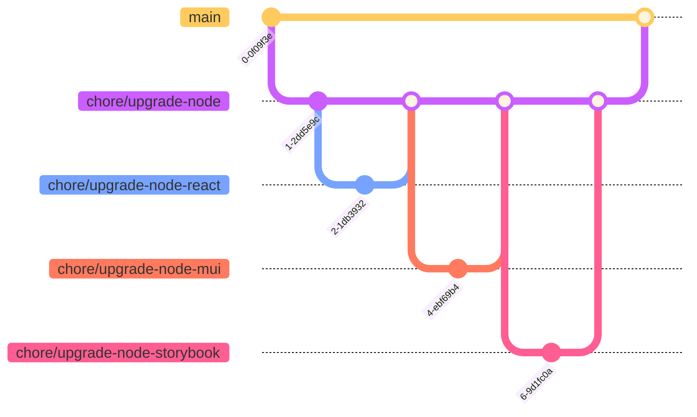

import { MdxCode, MdxPre } from "@/components/mdx";

Pull requests are _the_ fundamental unit of change on many software projects. They allow code to be reviewed before going to Production and later serve as a handy reference when tracing the history of the code base. Thus, getting your pull requests reviewed and merged can be key to being productive as a contributor.

Previously I wrote some of my best tips on [code reviews](/articles/code-reviews) of others' pull requests.

In this article I'll share my learnings so far about what makes a good pull request.


## Cohesion over size

Though there are debates about pull request size, size may be less important than _shape_.

***What matters most is that a pull request is a coherent and cohesive change set.***

For example, a very large pull request might be relatively easy to review if the only change is to remove a single column from a very large CSV configuration file. Assuming the change is correct and desirable, and clearly explained and justified in the description, the diff itself can be conceptualised as one unit of change and cleanly reasoned about.


Conversely, a change that seems small in terms of number of lines could be difficult to review if those lines are unrelated or have many unrelated, unknown impacts. It might be better to split such a change into even smaller pull requests, with each pull request covering a separate impact space. This will make each pull request easier to reason about individually.


The concept of "unit of change" might be useful here. The reviewer should be able to mentally grasp and treat the change as a single cohesive unit. That way, it's easier to reason about and review.

(This idea draws on notions of [chunking](https://en.wikipedia.org/wiki/Chunking_(psychology)) in Psychology and [Single-responsibility principle (SRP)](https://en.wikipedia.org/wiki/Single-responsibility_principle) in programming.)

Applying the "unit of change" concept to pull requests:

***Keep related changes together in one pull request, so they can be reasoned about as a single unit.***


> Pull-quote: “Just as the Single Responsibility Principle states that a class should have only one responsibility, so should a Pull Request address only a single concern.”
>
> – Mark SEEMANN • [_10 tips for better Pull Requests_](https://blog.ploeh.dk/2015/01/15/10-tips-for-better-pull-requests/)

An additional advantage to cohesive pull requests is that they can be easily rolled back if there is a problem.

Sometimes it makes sense to split related changes across multiple pull requests. Some changes lend themselves to being decomposed into a sequence of smaller changes. 

For example, removing a feature from an application might impact multiple unrelated areas of the application. In that case, it might make sense to remove the feature from each area one at a time, until it has been completely removed. At each stage of the removal, the whole application should build and function properly.


## Separating formatting from content

Have you ever been faced with a massive pull request – thousands of lines – only to discover on investigation that it was ***just a formatting change***?

For example, a change from tabs to white spaces or from TSV to CSV.

It's better to perform such a formatting change in a separate pull request if possible, clearly labelled as such. This will save reviewers a lot of time spent investigating the change.

> Pull-quote: “If you really need to address white space issues, move code around within files, change formatting, or do other stylistic changes to the code, please do so in an isolated pull request that does only that, and state so in your Pull Request comment.”
>
> – Mark SEEMANN • [_10 tips for better Pull Requests_](https://blog.ploeh.dk/2015/01/15/10-tips-for-better-pull-requests/)

Sometimes this separation isn't easy or even possible, however. For example, automated formatting tools might force formatting changes to be included in content changes. For these cases, you could add a brief [inline note](#inline-notes) to each block of changes, informing the reviewer that they are just formatting changes.


## Sub pull requests

In certain cases, we have a large but atomic change. The change has a broad impact, but it needs to be applied atomically or "all at once" and cannot be decomposed into a sequence of smaller changes.

For example, suppose we need to upgrade a core dependency, say NodeJS, which has multiple second-order dependencies. All of the dependencies need to be upgraded together. But it is impossible or unadvisable to upgrade each second-order dependency in a completely separate pull request.

In cases like these, the approach of "sub pull requests" can be useful. Here we create one large pull request in the main branch.



For example:
- `chore/upgrade-node` → `main`

Then we create multiple smaller pull requests into the larger pull request branch.

For example:
- `chore/upgrade-node-react` → `chore/upgrade-node`
- `chore/upgrade-node-mui` → `chore/upgrade-node`
- `chore/upgrade-node-storybook` → `chore/upgrade-node`

Then we merge each of the sub pull requests into the larger pull request, followed by merging the larger pull request into the main branch.
1. `chore/upgrade-node-react` → `chore/upgrade-node`
2. `chore/upgrade-node-mui` → `chore/upgrade-node`
3. `chore/upgrade-node-storybook` → `chore/upgrade-node`
4. `chore/upgrade-node` → `main`

This approach gives us the best of both worlds. The team can reason about and review each piece of the code separately. And then, after all the changes are have been merged into the main pull request, that pull request can be merged once, atomically. And it can be rolled back with a single revert, if something goes wrong.


## Conventional naming

Depending on your project setup and team expectations, certain conventions might need to be followed.

These conventions might apply to:
- Title of the pull request
- Branch name
- Commit messages
- Tags on commits
- Tags on the pull request

Some teams use [conventional commits](https://www.conventionalcommits.org/), requiring commit messages to be prefixed with category such as `feat` (feature), `fix`, etc. Other teams use tools to generate `CHANGELOG` and manage [semantic versioning](https://semver.org/), such as [release-please](https://github.com/googleapis/release-please).

Automated build, release and deployment processes might expect the pull request title, commit messages and/or branch name to have a certain format. They might also detect certain tags being added to a pull request, to turn on or off CI features such as staging website generation or automated security check.

If you are a new joiner, it's best to ask the team as early as possible about these, ideally during onboarding.


## Structured description

Pull request descriptions are often under-utilised or over-utilised.

We don't want to go into unnecessary detail about a change, overwhelming the reader. We can safely omit topics that can be readily grasped by some experience with the code base or are already documented (for example, in the task ticket, Wiki pages, etc). A simple reference to the relevant task ticket could be included in the description for easy single click access.

On the other hand, we don't want to go to the other extreme and write a "lazy" description, omitting important context. This will just complicate the lives of our reviewers, who have to put in additional work to dig up the information they need to properly review the changes.

I think the right balance is:

***Include important details specific to the pull request and not documented elsewhere.***

The pull request description should _complement_ other available sources of information, filling in any critical gaps.


Some content to include in a description, if not already covered elsewhere:

- **Links.** To task ticket and other pull requests (such as parts of a sequence).
- **Summary.** Brief one-sentence summary of changes.
- **Technical details.** Technical details the reviewer should know about, which are not already documented somewhere.
- **Local setup instructions.** Whatever is needed to test the change. For example: shell commands, port numbers, environment variables, feature flags, etc.
- **Testing details.** Such as test steps and test data.
- **Impacts.** On behaviour, systems, processes or code.
- **Monitoring.** Guidance on monitoring the change when it goes into production. Such as where to find logs.
- **Screenshots.** Before and after screenshots or recordings, including various screen sizes as needed.
- **Diagrams.** Such as systems involved or impacted. In Mermaid format.
- **Notes.** Listing of all inline notes (self-comments) with links to each note.

For screen recordings, I prefer to avoid animated GIFs and instead use formats such as MP4, as these formats allow the viewer to manually scroll through the video. I use a compression tool, such as [HandBrake](/uses/hand-brake), to reduce the file size before uploading.


## Collapsible regions

Collapsible regions, supported in GitHub pull request markdown, can be a great way to present a high-level outline to the viewer, hiding lower-level details until/unless the reader is interested to dig deeper by clicking to expand the region.


```md
<detail>
<summary>Screenshots</summary>


</detail>
```

This follows the UX principle of [progressive disclosure](https://www.nngroup.com/articles/progressive-disclosure/). We show the most important details to the viewer upfront and allow them to drill into finer details only if they want to.


## Description template

Many projects provide a [pull request template](https://docs.github.com/en/communities/using-templates-to-encourage-useful-issues-and-pull-requests/creating-a-pull-request-template-for-your-repository) in a standard `docs/pull_request_template.md` file. This can be a good place to begin, when forming your pull request description, as it typically provides guidance, such as a list of elements your description should contain and in what order.

Description templates often contain helpful information, such as checklists of verification steps, todo lists for authors and snippets of commonly used text.

> Pull-quote: “Our team implemented a similar approach by including a checklist of manual verification steps to perform as part of a change request. The checklist, in the form of a to-do list, is included in the GitHub pull request template for our repositories.”
>
> – Cloves CARNEIRO Jr.,  Tim SCHMELMER • [_Microservices from Day One_](/reading/a-philosophy-of-software-design) • Chapter 8, pp. 112


## Re-usable snippets

You may find it helpful to keep a handful of "snippets" – pieces of text that can be copied and pasted to quickly scaffold a pull request description. These can be kept as, say, Text (`.txt`) or Markdown (`.md`) files in a local folder.

For example, if your pull requests frequently include "feature flag" instructions, you can set up a reusable "feature flag" snippet. Whenever needed, you can copy and paste the "feature flag" snippet into the pull request and then easily adjust the feature flag keys.

<MdxPre>
    <MdxCode className="language-md">{`
## Feature flag instructions

Please run the following, to enable feature flags:

\`\`\`sh
FEATURE_FLAGS="FEATURE_1;FEATURE_2" && \\
echo $FEATURE_FLAGS
\`\`\`
`}
    </MdxCode>
</MdxPre>


## Inline notes

Some pull requests can benefit from additional notes about the code which would be inappropriate to include as comments in the code itself.

These might include open questions to code reviewers (which are to be replied to in a discussion thread), explanations of why a change was made or guidance on how to test a change.

These inline notes can be added as comments on specific lines of code or whole code files.

You can prefix the notes to make them easier for code reviewers to scan.

- `Note:` - additional context to help the reviewer understand the change.
- `Explanation:` - explanation of why the change is being made.
- `Warning:` - warning to the code reviewer of some risk or gotcha they might encounter.
- `Question:` - open question, to be answered or discussed in a reply or over team chat.
- `Testing:` - instructions on how to test a piece of code, perhaps including mock data.
- `Screenshot:` - inline screenshot of a single page, component, etc.


You might include testing instructions with small snippets of code, if it will save the reviewer's time, and assuming they cannot be expressed in an automated test.


If there are multiple inline notes, you can collect them into a summarised list, along with links back to the source, in the description (perhaps in a collapsible region). This allows the reviewer to glance and scan them at a high level.


```md
<details>
<summary>Notes</summary>

- [Note 1](https://github.com/jonathanconway/conwy/pull/4/changes#r3840098965): Question: Should we optimise this function?
- [Note 2](https://github.com/jonathanconway/conwy/pull/4/changes#r3840102986): Explanation: Re-generated by content-anchors tool, following content update.

</details>
```


## Communication

It's important to choose the right channel to communicate your pull request.

Depending on the set up at your organisation, your team members might automatically be notified of your pull request as soon as it is opened. If not, you might need to manually add them as reviewers and/or ping them in the team chat (such as Slack).

It might be helpful to tag specific individuals if broadcasting a PR to a larger team through, say, the team chat channel. This way, you can involve the right people in code review while keeping the rest of the team in the loop.


## Discussions

Discussions in code review can get pretty deep, especially during the early stages of a project or when discussing a complex issue. Too many nested comments in a pull request can be difficult for reviewers to keep track of and obscure the communication from the wider team.

For this reason you might want to take deeper discussions into a more appropriate forum, such as team chat (Slack or equivalent) or a call (Teams, Google Meet or equivalent). These more real-time and chat oriented spaces can smooth and speed up communication, enabling you to get your pull request merged sooner.

You should make sure to add links to such discussions to the pull request, either in the description or comments thread. These can serve as valuable references for future maintainers who view the pull request, perhaps via Git blame.


## Drafts

Submitting pull requests in draft mode can be a good way to "sketch" a change and get early feedback on the overall direction before going too deep. Draft pull requests are a great way to do solution design as a team, as they ground the design **in the code** rather than getting too abstract with diagrams or wordy descriptions.

Multiple drafts can be created to compare and contrast alternative designs. Producing alternative designs, comparing them, and selecting one is a tactic recommended by software design expert John Ousterhout.

<a name="content--book--a-philosophy-of-software-design" />

> Pull-quote: “Even if you are certain that there is only one reasonable approach, consider a second design anyway, no matter how bad you think it will be. It will be instructive to think about the weaknesses of that design and contrast them with the features of other designs.”
>
> – John OUSTERHOUT • [_A Philosophy of Software Design_](/reading/a-philosophy-of-software-design)

Alternative drafts can be referenced in team documentation, such as ADRs.


## Further reading

- [Video: What is a Pull Request, and How Do I Write Great Pull Requests? • Matt STAUFFER](https://www.youtube.com/watch?v=_HedItVFr5M)
- [Blog: 10 tips for better Pull Requests • Mark SEEMANN](https://blog.ploeh.dk/2015/01/15/10-tips-for-better-pull-requests/)
- [Blog: On commenting and approving pull requests • Jake WORTH](https://www.jakeworth.com/posts/on-commenting-and-approving-pull-requests/)