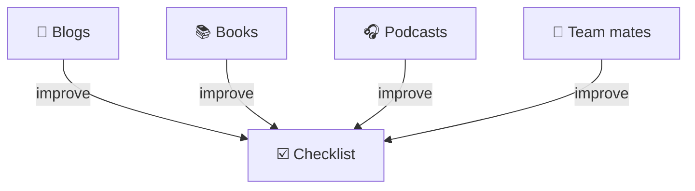

import { ContentEmbed } from "@/components";
import { ContentTypes } from "@/framework/client";
import FrontEndDevelopmentChecklist from "@/content/checklists/front-end-development/content.mdx";

I thought I would share my front end development checklist.

## Background

### Why I use a checklist

Many who worked with me will know I'm a big fan of checklists. A good checklist benefits me in numerous ways.

- **It helps me get started.** When the task ahead seems overwhelming, such as reviewing a giant pull request, I just start with the first checklist item and keep going from there.
- **It helps me organise my thinking.** Get clarity on what matters and doesn't matter; avoid getting overloaded.
- **It helps me identify blind-spots.** Common human biases (such as confirmation bias) and also my own individual biases (from past experiences).

Professional software construction and code review are complex tasks involving many elements. For example, software projects may involve tens or even hundreds of interrelated modules. Up to 18 non-functional requirements have been identified, any number of which might be important.

But research has shown that the human mind is limited. We can only work with a finite number of concepts at a given time. Felienne Hermans discussed this in her book on programmer cognition.

> Pull-quote: “Like the STM (short term memory), the working memory is only capable of processing two to six things at a time. In the context of working memory, this capacity is known as the cognitive load . When you are trying to solve a problem that involves too many elements that cannot be divided efficiently into chunks, your working memory will become “overloaded.””
>
> – [Felienne HERMANS • The Programmer's Brain](https://www.oreilly.com/library/view/the-programmers-brain/9781617298677/) <small>(brackets mine)</small>

Additionally, as research has shown, the human mind can be affected by cognitive flaws such as biased thinking. While we are capable of thinking rationally, our minds, in an attempt to conserve energy, often default to a shortcuts and heuristics. These can result in us making critical errors. Khaneman refers to these two modes of thinking as System 1 and System 2.

> Pull-quote: • System 1 operates automatically and quickly, with little or no effort and no sense of voluntary control.
>
> • System 2 allocates attention to the effortful mental activities that demand it, including complex computations. The operations of System 2 are often associated with the subjective experience of agency, choice, and concentration.
>
> – [Daniel KAHNEMAN • Thinking, Fast and Slow](https://en.wikipedia.org/wiki/Thinking,_Fast_and_Slow)

Surgeon and author Atul Gawande famously wrote a book about checklists, demonstrating their use in overcoming such biases in various mission-critical contexts, from passenger flights to hospital operating rooms. The same principles can be applied to front end development, when tasks are complex and quality matters.

> Pull-quote: “Checklists seem to provide protection against such failures. They remind us of the minimum necessary steps and make them explicit They not only offer the possibility of verification but also instill a kind of discipline of higher performance.”
>
> – [Atul GAWANDE • The Checklist Manifesto](https://en.wikipedia.org/wiki/The_Checklist_Manifesto)

### How I use a checklist

I use this coding checklist both to review my own work as well as to review others'.

- **Prior to submitting my changes for code review.** I check my work against the list. This allows me to anticipate and address any issues in advance, which reduces the code review burden on team mates and helps me to get faster approvals.
- **When code reviewing others' changes.** I check others' work against the list. This allows me to deliver useful feedback and mentor team mates.

When scanning the list and picking items to check, I factor in what makes sense for my current team.

### Variants of the checklist

Here I provide a general front end development checklist. But typically I will create one variant of the checklist for each specific project I work on. This variant takes into account the unique differences and peculiarities of each project.

### Automation and AI

Of course, much of good coding practice can and should be automated away. We have compilers, linters, formatters and, more recently, AI agents. What remains will likely consist of broader or more abstract thinking, requiring a human.

However, despite AI agents possibly being able to do most of the heavy lifting of writing and reviewing code, I think it's still important to review agent output myself, just to be sure. As Mike Mason points out in a blog post, we don't really know the quality of AI generated code until we read it ourselves.

> Pull-quote:“Both things are true: there is good architecture in Claude Code, and there is also an incomprehensible mess. That's actually the point. **You don't get to know which is which without reading the code**.”
>
> – Mike Mason • [The Code You're Not Reading](https://mikemason.ca/writing/ai-slop-code-april-2026/) <small>(bold mine)</small>

Checklists can serve as a valuable input into AI agents.

Firstly, a checklist can be included in an agent "code review" skill, helping the agent to provide useful feedback and even action the feedback itself. The checklist can be broken down into sections, each having guidance on when the agent should read it. This follows the principle of progressive disclosure, minimising context use and streamlining agent performance.

Secondly, a checklist can to form prompts, by helping me to know what kinds of questions to ask or how to frame prompts.

To pick a random example: suppose I was prompting AI to implement a server-side call to retrieve a list of contacts.

> Implement a new endpoint, `/contacts-list`, which returns a JSON-formatted list of contacts.
> It should retrieve contacts from the `getContacts` gRPC endpoint on the `ContactsService`.

Consulting the checklist, I might notice the following item:

> - [ ] Cache service-service or service-database calls to improve performance. For example, in a NextJS backend, wrap API service calls in `cache`.  #general--caching #nfr--performance

With this awareness, I could include in my prompt an instruction to cache service calls:

> Implement a new endpoint, `/contacts-list`, which returns a JSON-formatted list of contacts.
> It should retrieve contacts from the `getContacts` gRPC endpoint on the `ContactsService`.
> Make sure the API call is cached by wrapping it in a NextJS `cache` function call.

### Continuous improvement

When I receive feedback on a code review, I incorporate that feedback into the checklist if not already there. I either add or modify an item. I also include a link or reference to the specific feedback comment that triggered the change. 

Also I continuously learn from a broad and diverse array of resources and incorporate that learning into my checklist. Without consulting these resources, my checklist might become biased to my own past experience. By continuously learning and improving, I can quickly fill gaps in my knowledge.

The resources I learn from include books, courses, podcasts, open-source code-bases and previous code reviews by team mates. You can find a non-exhaustive list of the publicly available resources linked in the checklist itself and also in the [Further reading](#further-reading) section of this article.

These practices combine to make the checklist a continuously improving system.

## Organising and filtering the checklist

With a checklist of 575 items and counting, you might well wonder: how can we ever have time to go through that many items?

My solution is to only use a subset of checklist items in each situation. So we group the checklist items into categories using tags and add a filter control. This allows us to quickly narrow down the list to a much more manageable size as needed.

For example, suppose I'm reviewing a code change that only affects one build script written in Javascript.

I can filter the list down to only items that are likely to apply.

- General
  - ✅ Build
  - ✅ Configuration
  - ✅ Pull request
- Language
  - ✅ Javascript

To minimise the risk of missing something important, I set up the filters to be additive. That is, if I tick 2 filters, I see items covered by either and both of them. This maximises the number of _relevant_ checklist items that get shown while limiting them to a workable quantity.

## Front End Development Checklist

Here is the link: [Front End Development Checklist](/checklists/front-end-development).

## Further reading

### Cognitive biases

- [Book: The Checklist Manifesto • Atul GAWANDE](https://en.wikipedia.org/wiki/The_Checklist_Manifesto)
- [Book: The Programmer's Brain • Felienne HERMANS](https://www.oreilly.com/library/view/the-programmers-brain/9781617298677/)