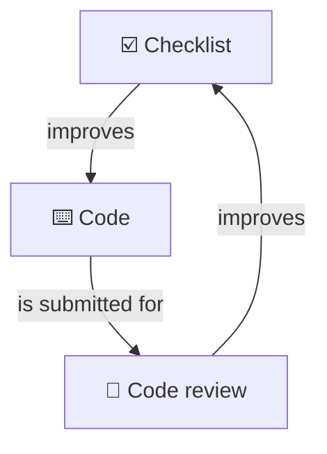

import { LinkCta } from "@/components";
import { ContentTypes } from "@/framework/client";
import FrontEndDevelopmentChecklist from "@/content/checklists/front-end-development/content.mdx";

I thought I would share my front end development checklist.

## Why I use a checklist

Many who worked with me will know I'm a big fan of checklists. I think a good checklist can benefit you in several ways.

- **It helps you get started.** When the task ahead seems overwhelming, such as reviewing a giant pull request, I just start with the first checklist item and keep going from there.
- **It helps you organise my thinking.** Get clarity on what matters and doesn't matter; avoid getting overloaded.
- **It helps you identify blind-spots.** Common human biases (such as confirmation bias) and also your own individual biases (from past experiences).

Professional software construction and code review are complex tasks involving many elements. Research shows that the human mind is limited and can only work with a finite number of concepts at a given time.

> Pull-quote: “the working memory is only capable of processing two to six things at a time ... When you are trying to solve a problem that involves too many elements ... your working memory will become “overloaded.””
>
> – [Felienne HERMANS • The Programmer's Brain](https://www.oreilly.com/library/view/the-programmers-brain/9781617298677/) <small>(brackets mine)</small>

Additionally, research shows the human mind can be affected by cognitive flaws and biased thinking. While we are _capable_ of thinking rationally, our minds, in an attempt to conserve energy, often default to a shortcuts and heuristics, leading to critical errors. In [_Thinking, Fast and Slow_](https://en.wikipedia.org/wiki/Thinking,_Fast_and_Slow), cognitive psychologist Daniel Khaneman describes several of these errors, such as the anchoring effect (when people consider a particular value for an unknown quantity before estimating that quantity) and availability (when people focus on the information that is most readily available while overlooking other potentially important information).

Checklist can help us overcome these biases and errors. Surgeon and author Atul Gawande famously wrote a book about this, demonstrating the use of checklists in mission-critical contexts from passenger flights to hospital operating rooms. The same principles can be applied to front end development, when tasks are complex and quality matters.

> Pull-quote: “Checklists seem to provide protection against such failures. They remind us of the minimum necessary steps and make them explicit. They not only offer the possibility of verification but also instill a kind of discipline of higher performance.”
>
> – [Atul GAWANDE • The Checklist Manifesto](https://en.wikipedia.org/wiki/The_Checklist_Manifesto)

Similar points about checklists have been made by [Michael Mauboussin](https://www.jermainebrown.org/posts/michael-mauboussin-and-charlie-munger-checklists-tame-luck) and [Charlie Munger](https://www.jermainebrown.org/posts/the-psychology-hacks-behind-charlie-mungers-billion-dollar-decisions).

## How to use a development checklist

You can use a development checklist in the following ways:

- **Self-review, prior to submitting changes.** Check your work against the list. This gives you an opportunity to anticipate and address any issues in advance, which reduces the code review burden on team mates and helps you to get faster approvals.
- **Code-review, on others' changes.** Check others' work against your checklist. You can deliver useful feedback and mentor colleagues.

When scanning the list and picking items to check, you can factor in what makes sense for your current team and project. In this article I provide a general front end development checklist. But you can create your own variants of the checklist, such as one for each project.

## Automation and AI

Checklist reviews can be partially or fully automated using AI assistants.

You can feed a checklist, along with the code, into an AI assistant, using a prompt such as the following:

```md
Please review the code changes in the current branch.

Look at the checklist in the file: `≪~/Downloads/front-end-development-checklist.md≫`.

Identify which checklist items are relevant for this change.

For each relevant checklist item:
- Review the code change and evaluate whether complies or not.
- List any checklist items for which the code change is not compliant.
- For each non-complied checklist item, provide an explanation and recommendation on how to address it.
```

> Aside: If performance is poor or costing you a lot of tokens, one solution is to break down the checklist into smaller sub-lists. Each sub-list can have a `"description"` section, specifying the conditions under which the AI assistant read and use it. Following the principle of progressive disclosure, this can minimise context use and streamline AI performance and cost efficiency.

There are many other ways a checklist can be used with AI.

* When vibe-coding, include instructions for the AI assistant to self-review its work against the checklist, either in the prompt or in context files.
* When using the AI assistant to generate a solution design, prompt it to self-review the solution design against the checklist.
* Prompt the AI assistant to go review the whole code-base against the checklist and list cases where the items are not complied with.

## Continuous improvement

Feedback you receive in code reviews can be incorporated back into the checklist.

This creates a cycle of continuous improvement, making the checklist a dynamic adaptive system.



Other high quality resources that can be used as sources for checklist items include:

- Books
- Courses
- Podcasts
- Open-source
- Feedback from past projects

> Aside: You can find a list of [Resources](#resources) used in my [Front end development checklist](/checklists/front-end-development).

## Precedent-based model for code reviews in less mature teams

For team projects, where I add/modify a checklist item in response to feedback, I like to include a link to specific feedback comment.

In subsequent code reviews, if a similar issue is being discussed, I can simply locate the closest matching guideline in the checklist and mention it in the discussion thread, with a link back to the original discussion. The linkage to the prior discussion helps to ground the discussion and provides a precedent for my decision in that specific case.

I found success with this approach, in the following ways:

- In most cases, the team agree to stay consistent with the approach suggested by the link to the prior discussion. This agreement helps to drive consensus and move the pull request toward approval.
- In some cases, a different approach is proposed. Agreement is found. I can improve the checklist by updating it with a link to this more recent discussion. Additionally, the team benefits by gaining more clarity over the reasoning behind the decision and also a sense of the broader approach being followed.
- In a few cases, there is lively debate about which approach to follow. Here, the "precedent model" helps us to organise our thinking and to keep the discussion on-track. In the worst case, I can at least demonstrate effort and maintain forward momentum.

## Organising and filtering the checklist

With a checklist of 575 items and counting, you might wonder how you'll ever have the time to go through that many items.

One solution is to only use a subset of checklist items in each situation. My Front end development checklist groups items into heading and also filterable tags. You can quickly narrow down the list to a much more manageable size by using the tag filters.

For example, if you're reviewing a code change that only affects styling, you can filter by the CSS tag.


## Front End Development Checklist

Here is the link:

<LinkCta
  title="Front End Development Checklist"
  description="Covers common front end development concerns. Includes front end frameworks and languages, and non-functional requirements such as accessibility and security."
  href="/checklists/front-end-development"
  imageSrc="/images/articles/front-end-development-checklist/main.png"
/>

## Further reading

- [Book: The Checklist Manifesto • Atul GAWANDE](https://en.wikipedia.org/wiki/The_Checklist_Manifesto)
- [Book: The Programmer's Brain • Felienne HERMANS](https://www.oreilly.com/library/view/the-programmers-brain/9781617298677/)
- [Book: Thinking, Fast and Slow • Daniel KAHNEMAN](https://en.wikipedia.org/wiki/Thinking,_Fast_and_Slow)