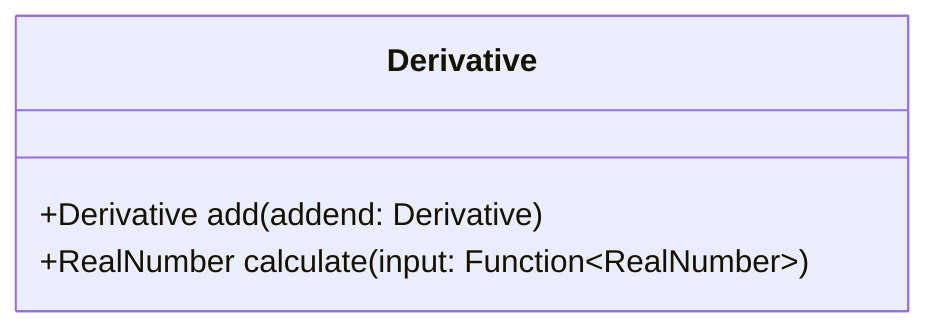

import { meta } from "./meta";
import { MdxImg } from "@/components";

> Summary: Completing an Introduction to Calculus taught me a range of interesting lessons including lessons about learning, such as the importance of understanding fundamentals, visualisation, geometric analogies, parts vs. whole, focussing on correcting mistakes and thinking deeply about small things.

> “I never regretted the time I spent on history and on math. Math sharpens
> your mind, history gives you some idea of your limitations and what’s going
> on in the world.”
>
> – Bjarne STROUSTRUP ([Video](https://www.youtube.com/watch?v=-QxI-RP6-HM))

> “Curiosity is recognizing a gap in our knowledge about something that
> interests us, and becoming emotionally and cognitively invested in closing
> that gap through exploration and learning.”
>
> – Brené BROWN • _Atlas of the Heart_

Recently I completed [*Introduction to Calculus*](https://www.coursera.org/learn/introduction-to-calculus) on Coursera.

My motivations were:

* To improve my foundational math skills, enabling a better understanding of computing foundations and machine learning.
* To test and improve my learning skills by studying a less familiar field outside comfort zone.
* Ok... the real reason... to gain entry to the Sydney University B. Adv. Comp. program! 😄

The course has been fascinating and engaging. It's not only introduced me to Calculus but also helped me to brush up on basic arithmetic and algebra where I discovered I had serious gaps. [Prof David Easdown's](https://www.sydney.edu.au/science/about/our-people/academic-staff/david-easdown.html) regular participation in the forums was valuable gift to us students!

Some reflections in no particular order:

## Understanding fundamentals

The hard part often isn't the highest level concepts, but the foundations you need in order to (properly) understand and use them. I had to understand concepts such as *completing the square*, *long division of polynomials* and *derivatives*, not only theoretically, but well enough to apply them correctly to solve an unexpected problem. I've [commented](https://news.ycombinator.com/item?id=40083488) about this on HackerNews.

## Benefits of drawing, visualising

Using a high quality notebook and pen helped with enjoyment and motivation to study! Fleshing out problems on paper, down to the fine details, helped me to see how the pieces of a problem fit together, which was quite fascinating.


## Geometric analogies

I found it incredibly helpful when David presented an idea *geometrically*. Simple shapes such as triangles are intuitive to many learners. And the [Theorem of Pythagoras](https://en.wikipedia.org/wiki/Pythagorean_theorem) is now widely understood. The curve sketching exercises and Riemann sum rectangles were memorable examples but there were so many other cases where David made the idea clearer by some kind of geometric metaphor.

## Parts vs. whole

I found that solving a non-trivial math problem typically requires also understanding all the parts of the problem. (This is in contrast to my usual profession, software development, where many problems can be solved using "black-box" solutions such as libraries, without understanding their internals.) This experience of the parts/whole adds a dimension to my understanding of problem solving generally.

## Focussing on mistakes

Trying out the examples and practice tests and observing what I got wrong helped me narrow down specifically where my knowledge gaps lay and then actively correct them, which also helped improve my long-term memory of the concepts. (This way of thinking is also helping me in other areas of life beyond math.)

## Different learning methods at different stages

I found different learning techniques useful at different stages of the course. Early in the course, I found repeated practice and deep thinking most useful. Midway through, I found sketching and visualisation more productive. Late in the course, I found all the above useful, plus reading various additional sources such as books.

## Thinking deeply about small things

Prof David mentioned this in one of the videos - such a powerful insight! Sometimes on a walk or another repetitive activity I turned over an idea in my head to try and understand it in its essentials (e.g. I did this a lot with Leibniz notation, trying to understand it at some deeper level than words).

## Temporarily suspending understanding

Introspectively, I found that getting stuck (what people call "writers block", "analysis paralysis", etc) often happens when I'm trying to understand an interconnected complex of ideas and am uncertain how to break them down. Here the usual approach of "divide and conquer" or breaking down the problem into smaller pieces doesn't work because I don't know how or according to what criteria to break them down. One way to proceed is to temporarily suspend trying to understand some parts so that I can focus on others. I'll treat them as small "black boxes" so that I can skip learning them. This enables me to move on to other problems and not be blocked.

## Concepts vs. application

Abstract conceptual knowledge is not the same thing as knowledge that can be applied. I could read a book on Calculus without really understanding it, but doing the practice tests in this course was better. After this course it's more likely that I'll be able to see a problem, see where Calculus might help, identify/name the components and then try to solve it using appropriate methods.

## The power of good notation

Prof David mentioned this in one of the videos on Leibniz notation. Amazing, rich insight. This immediately inspired ideas that I've been translating into my software development practices. Representing a problem differently can open the way to unexpected solutions. This inspired my [code selectors](/projects/codeselectors) project.

## Mathematics as a language

Sometimes thinking of a mathematical idea as language, or a set of concepts, helped me to understand it better.

Rather than trying to understand a concept's full meaning immediately, I tried first to think of it as a just label, which could then be gradually enriched with attributes and relationships, until I eventually had a more complete understanding of its meaning.

I was also able to leverage tools of thinking I was already familiar with, as a programmer, such as object-oriented (OO) modelling and relational database querying (SQL).

I found this learning technique helpful with understanding the concept of the derivative:

> ### Concept: Derivative
>
> Attributes:
> - It is a tool which can be applied to a function over the domain of real numbers
> - It can be defined as the limit of the function to which it is applied (that is, the value the function approaches as its input gets closer to some limit)
> - It is additive - you can add derivatives together, forming a new derivative, which is the derivative of the two functions added together

In object-oriented programmer-speak:

- The `Derivative` class...
  - Supports methods:
    - `add` (with `Derivative` as parameter and return type)
    - `calculate` (with `RealNumber` as return type)



In this way I was able to use my skill with object oriented (OO) modelling as a "bridge" to help me obtain an understanding of a mathematical concept.

By gradually building up and enriching in my mind these characteristics of the derivative (often meditating on them during long walks) I gradually started to develop an understanding of its basic nature. This helped me a later to understand the role the derivative plays in the bigger scheme of things, such as when differentiating and integrating. A lot of this meditation involved connecting the concept to other concepts I was more familiar with, such as functions, real numbers and basic arithmetic.

Another case where this technique helped was in understanding [Euler's number](https://en.wikipedia.org/wiki/E_(mathematical_constant)). Rather than trying to think of it as a particular number (which stumped me for a while) I found it better to think of it as the *criteria* for some particular number.

In relation database terms, I imagined a `SELECT` statement used to find Euler's number from a list of famous mathematical constants. It might include multiple `WHERE` or `AND` clauses, but yield a single result: _e_ itself.

The criteria would be:
- Is a real number
- Is larger than 1
- Is the limit, as _n_ goes to infinity, of 1 plus 1 over _n_ all raised to the _n_ power

I won't try to write the full SQL query. 😅 But at a high level, it might start off like this:

```sql
SELECT *
FROM MathConstants
WHERE NumberType = 'REAL_NUMBER'
AND Value > 1
```

## Growth can be deceptive

Toward the end of the course, I learned about the logistic function, which produces an S-curve that limits exponential growth.

Applying this to the notion of time, I stumbled upon what I consider to be a profound truth about life: **fast, apparently endless growth can taper off quite suddenly**! It will deceptively appear that a trend still has momentum, as the ground gained thus-far is not lost. But make no mistake, if growth slows, the slowdown will eventually be felt.

With a conceptual understanding of limits to growth, one can mentally get "ahead of the curve" and plan for a future non-growth or steady state scenario.


https://www.desmos.com/calculator/t8xi2q4p9m

## Directions for further study

I greatly appreciated David's frequent references and pointers to areas for further study. Explaining the *proofs* of a method, rather than just the method itself, is one example – I could use this knowledge for [formal verification](https://en.wikipedia.org/wiki/Formal_verification). Referencing more advanced concepts such as series expansions is another example. This makes me curious and motivates me to study the field further.

I started this course with some trepidation and had many challenges along the way, but I feel a great sense of satisfaction after completing it.

Now I can't wait to jump into my next learning challenge: [Linear Algebra](https://www.coursera.org/learn/introduction-to-linear-algebra)!

## Further reading

- [_Precalculus: Mathematics for Calculus, Seventh Edition_](https://www.amazon.com.au/Precalculus-Mathematics-Calculus-James-Stewart/dp/1305071751) • James STEWART, Lothar REDLIN, Saleem WATSON
- [_How to Solve It_](https://en.wikipedia.org/wiki/How_to_Solve_It) • George POLYA

